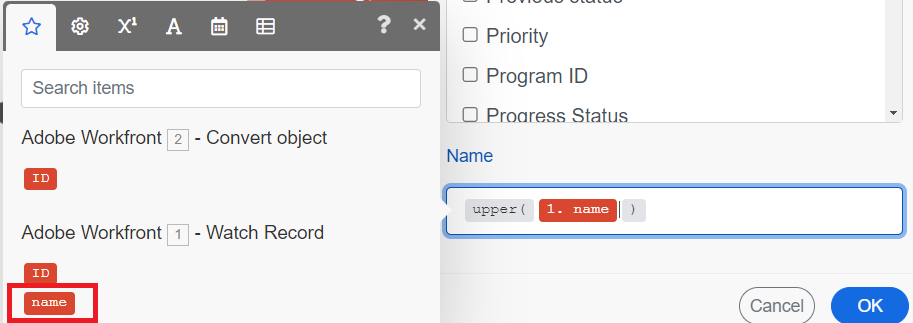

# 기본 시나리오에서 함수를 사용하여 프로젝트 업데이트

Workfront 작업 항목 업데이트는 Workfront Fusion의 일반적인 사용 사례입니다. 이 예제에서는 함수를 사용하여 프로젝트 이름을 대문자로 변경합니다.

Fusion에는 데이터에 대해 조건부 논리를 변환하고 수행할 수 있는 다양한 유형의 함수가 포함되어 있습니다. 함수 사용에 대한 자세한 내용은 [함수 개요](/help/workfront-fusion/get-started-with-fusion/understand-fusion/function-overview.md)를 참조하십시오.

이 예제에서는 [기본 시나리오 만들기](/help/workfront-fusion/build-practice-scenarios/create-basic-scenario.md)에서 만든 시나리오를 수정합니다.

## 액세스 요구 사항

+++ 을 확장하여 이 문서의 기능에 대한 액세스 요구 사항을 봅니다.

이 문서의 기능을 사용하려면 다음 액세스 권한이 있어야 합니다.

<table style="table-layout:auto">
 <col> 
 <col> 
 <tbody> 
  <tr> 
   <td role="rowheader">[!DNL Adobe Workfront] 패키지</td> 
   <td> 
임의
 </td> 
  </tr> 
  <tr data-mc-conditions=""> 
   <td role="rowheader">[!DNL Adobe Workfront] 라이센스</td> 
   <td> 
신규: [!UICONTROL Standard]

또는

현재: [!UICONTROL Work] 이상
 </td> 
  </tr> 
  <tr> 
   <td role="rowheader">[!DNL Adobe Workfront Fusion] 라이센스**</td> 
   <td>
   
현재: [!DNL Workfront Fusion] 라이선스 요구 사항이 없습니다.

   
또는

   
레거시: 모두 

   </td> 
  </tr> 
  <tr> 
   <td role="rowheader">제품</td> 
   <td>
   
신규:
 <ul><li>[!UICONTROL Select] 또는 [!UICONTROL Prime] [!DNL Workfront] 플랜: 조직에서 [!DNL Adobe Workfront Fusion]을(를) 구매해야 합니다.</li><li>[!UICONTROL Ultimate] [!DNL Workfront] 플랜: [!DNL Workfront Fusion]이(가) 포함되어 있습니다.</li></ul>
   
또는

   
현재: 조직에서 [!DNL Adobe Workfront Fusion]을(를) 구매해야 합니다.

   </td> 
  </tr>
 </tbody> 
</table>

이 표의 정보에 대한 자세한 내용은 설명서에서 [액세스 요구 사항](/help/workfront-fusion/references/licenses-and-roles/access-level-requirements-in-documentation.md)을 참조하십시오.

[!DNL Adobe Workfront Fusion] 라이선스에 대한 자세한 내용은 [[!DNL Adobe Workfront Fusion] 라이선스](/help/workfront-fusion/set-up-and-manage-workfront-fusion/licensing-operations-overview/license-automation-vs-integration.md)를 참조하세요.

+++

## 전제 조건

이 절차를 수행하기 전에 [기본 시나리오 만들기](/help/workfront-fusion/build-practice-scenarios/create-basic-scenario.md)에 설명된 시나리오를 만들어야 합니다.

## 함수를 사용하여 프로젝트 업데이트

### 시나리오에 레코드 업데이트 모듈 추가

1. 시나리오 편집기에서 시나리오를 엽니다.
1. 두 번째 모듈의 오른쪽에 있는 부분 원을 마우스로 가리킨 다음 **[!UICONTROL Add another module]**&#x200B;을(를) 클릭합니다.
1. 응용 프로그램 목록에서 [!DNL Adobe Workfront]을(를) 선택한 다음 **[!UICONTROL Update Record]** 모듈을 선택합니다.
1. ID 필드에서 Convert 개체 모듈 아래에 있는 ID 블록을 선택합니다. 해당 모듈에서 출력된 프로젝트의 ID입니다.

   

1. 업데이트할 개체가 프로젝트이므로 레코드 유형 필드에서 프로젝트를 선택합니다.
1. 매핑할 필드 선택 영역에서 이름을 선택합니다.

   이름 필드가 열립니다.
1. [이름 업데이트에 대한 함수 매핑](#map-the-function-for-the-name-update)을(를) 계속합니다.

### 이름 업데이트를 위한 함수 매핑

이 시나리오가 요청을 프로젝트로 변환할 때 프로젝트의 이름이 요청과 동일합니다. 여기서 함수는 해당 이름을 사용하고 그 안에 있는 모든 문자를 대문자로 바꿉니다.

1. **이름** 필드를 클릭합니다.

   매핑 패널이 열립니다.
1. 매핑 패널에서 **텍스트 및 이진 함수** 아이콘을 클릭합니다. 
1. **upper** 함수를 선택하십시오.

   이 함수는 기대하는 입력에 대한 형식을 포함하여 이름 필드에 나타납니다.

   이 예제의 입력은 프로젝트가 전환된 문제의 이름입니다.

1. 입력이 진행될 위치이므로 커서를 괄호 사이로 이동합니다.
1. 매핑 패널에서 **모듈 출력** 아이콘을 클릭합니다. 
1. 첫 번째 모듈에서 출력한 이름 블록을 선택합니다.

   이름 블록이 함수에 나타납니다.

   

1. **확인**&#x200B;을 클릭하여 모듈 설정을 저장합니다.

### 테스트 및 활성화

1. 화면 왼쪽 하단의 **한 번 실행**&#x200B;을 클릭하여 시나리오를 테스트합니다.
1. 출력을 검사하여 시나리오가 예상대로 실행되었는지 확인합니다.
1. 시나리오가 예상대로 작동하는 경우 화면 왼쪽 하단의 **예약** 전환을 클릭하여 **켜기**&#x200B;로 전환합니다.

   이렇게 하면 시나리오가 활성화됩니다. 활성 시나리오는 트리거 모듈에 설정된 일정에 따라 실행됩니다.
1. [!DNL Workfront Fusion]에서 왼쪽 아래 모서리 근처에 있는 **[!UICONTROL Save]**&#x200B;을(를) 클릭하여 시나리오에 대한 진행률을 저장합니다.

   >[!IMPORTANT]
   >
   >원하는 만큼 자주 저장하고 시나리오를 테스트합니다.

## 리소스

* [함수를 사용하여 항목 매핑](/help//workfront-fusion/create-scenarios/map-data/map-using-functions.md)
