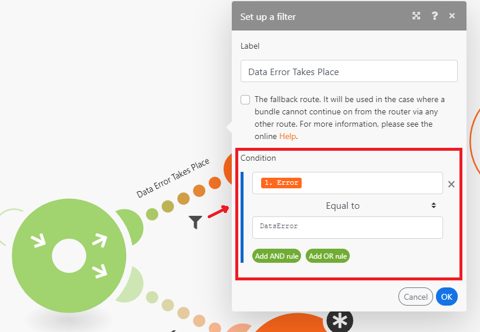

# 라우터 모듈 추가 및 경로 구성

라우터 모듈을 사용하면 시나리오를 여러 경로로 분기하고 각 경로 내의 데이터를 다르게 처리할 수 있습니다. 라우터 모듈이 번들을 수신하면 라우터가 라우터 모듈에 연결된 순서대로 연결된 각 경로로 전달합니다.

경로는 병렬로 처리되지 않고 순차적으로 처리됩니다. 이전 경로에서 완전히 처리될 때까지 번들이 다음 경로로 전송되지 않습니다.

## 액세스 요구 사항

+++ 을 확장하여 이 문서의 기능에 대한 액세스 요구 사항을 봅니다.

이 문서의 기능을 사용하려면 다음 액세스 권한이 있어야 합니다.

<table style="table-layout:auto">
 <col> 
 <col> 
 <tbody> 
  <tr> 
   <td role="rowheader">Adobe Workfront 패키지</td> 
   <td> 
임의
 </td> 
  </tr> 
  <tr data-mc-conditions=""> 
   <td role="rowheader">Adobe Workfront 라이선스</td> 
   <td> 
새로운 기능: 표준

또는

현재: [!UICONTROL Work] 이상
 </td> 
  </tr> 
  <tr> 
   <td role="rowheader">Adobe Workfront Fusion 라이센스**</td> 
   <td>
   
현재: Workfront Fusion 라이센스 요구 사항이 없습니다.

   
또는

   
레거시: 모두 

   </td> 
  </tr> 
  <tr> 
   <td role="rowheader">제품</td> 
   <td>
   
신규:
 <ul><li>[!UICONTROL Select] 또는 [!UICONTROL Prime] Workfront 플랜: 조직에서 Adobe Workfront Fusion을 구매해야 합니다.</li><li>[!UICONTROL Ultimate] Workfront 계획: Workfront Fusion이 포함됩니다.</li></ul>
   
또는

   
현재: 조직은 Adobe Workfront Fusion을 구매해야 합니다.

   </td> 
  </tr>
 </tbody> 
</table>

이 표의 정보에 대한 자세한 내용은 설명서에서 [액세스 요구 사항](/help/workfront-fusion/references/licenses-and-roles/access-level-requirements-in-documentation.md)을 참조하십시오.

Adobe Workfront Fusion 라이선스에 대한 자세한 내용은 [Adobe Workfront Fusion 라이선스](/help/workfront-fusion/set-up-and-manage-workfront-fusion/licensing-operations-overview/license-automation-vs-integration.md)를 참조하십시오.

+++

## 시나리오에 라우터 모듈 추가

라우터를 구성하기 전에 라우터 모듈을 추가해야 합니다.

1. 왼쪽 패널의 **[!UICONTROL 시나리오]** 탭을 클릭합니다.
1. 라우터를 추가할 시나리오를 선택합니다.
1. 시나리오의 아무 곳이나 클릭하여 시나리오 편집기를 입력합니다.
1. 시나리오 편집기에서 라우터를 추가할 모듈의 오른쪽 핸들을 클릭합니다.
1. 표시되는 모듈 목록에서 **[!UICONTROL 흐름 제어]** > **라우터**&#x200B;를 선택합니다.

   

   또는

   두 모듈 사이에 라우터 모듈을 삽입하려면 두 모듈을 연결하는 경로 아래의 렌치 아이콘을 클릭하고 메뉴에서 **[!UICONTROL 라우터 추가]**&#x200B;를 선택하십시오.

   
1. 라우터의 오른쪽 핸들을 클릭하고 모듈을 추가하여 라우터에 첫 번째 경로를 추가합니다. 이는 모듈을 추가하는 것과 유사합니다.
1. 다른 경로를 추가하려면 라우터 모듈을 클릭합니다. 경로가 나타납니다. 원하는 대로 이 경로에 모듈을 추가합니다.

   원하는 만큼 경로를 추가할 수 있습니다.

1. 경로의 순서를 확인하려면 자동 맞춤 아이콘 을 클릭하세요.

   경로는 실행되는 순서대로 배열됩니다. 상위 경로가 먼저 실행됩니다.

1. (선택 사항) 경로 순서를 변경하려면 라우터 모듈을 마우스 오른쪽 단추로 클릭하고 **경로 순서 지정**&#x200B;을 선택합니다. 경로를 실행할 순서대로 경로를 끌어서 놓습니다. 라우터는 라우터를 따르는 첫 번째 모듈(경로의 첫 번째 모듈)로 표시됩니다.

   

1. [경로에 필터 추가](#add-a-filter-to-a-route)를 계속합니다.

## 경로에 필터 추가

라우터 모듈 뒤에 경로를 지정하여 번들을 필터링할 수 있습니다. 필터를 통과하는 번들만 경로의 모듈에서 처리됩니다.

데이터가 두 개 이상의 경로 필터를 통과한 경우 데이터는 두 경로 모두에서 처리됩니다. 상위 경로는 먼저 데이터를 처리합니다.

1. 왼쪽 패널의 **[!UICONTROL 시나리오]** 탭을 클릭합니다.
1. 필터를 추가할 시나리오를 선택합니다.
1. 시나리오의 아무 곳이나 클릭하여 시나리오 편집기를 입력합니다.
1. 필터를 설정할 경로에서 렌치 아이콘 를 클릭합니다. 라우터 모듈과 경로의 첫 번째 모듈 사이의 경로입니다.
1. **필터 설정**&#x200B;을 선택합니다.
1. 표시되는 패널의 레이블 필드에 레이블을 추가합니다. 이 레이블은 시나리오에 표시됩니다.
1. 필터 조건을 구성합니다.

   자세한 내용은 [시나리오에 필터 추가](/help/workfront-fusion/create-scenarios/add-modules/add-a-filter-to-a-scenario.md)를 참조하십시오.

1. **[!UICONTROL 확인]**&#x200B;을 클릭하여 필터 설정을 저장합니다.

1. [대체 경로 구성](#configure-a-fallback-route)을 계속합니다.

## 대체 경로 구성

대체 경로는 필터를 다른 경로로 전달하지 않는 번들에 대해 실행되는 경로입니다.

필터 패널에서 대체 경로를 활성화할 수 있습니다.

1. 왼쪽 패널의 **[!UICONTROL 시나리오]** 탭을 클릭합니다.
1. 대체 경로를 추가할 시나리오를 선택합니다.
1. 시나리오의 아무 곳이나 클릭하여 시나리오 편집기를 입력합니다.
1. 필터를 설정할 경로에서 렌치 아이콘 를 클릭합니다. 라우터 모듈과 경로의 첫 번째 모듈 사이의 경로입니다.
1. **필터 설정**&#x200B;을 선택합니다.
1. 표시되는 패널의 레이블 필드에 레이블을 추가합니다. 이 레이블은 시나리오에 표시됩니다.
1. 대체 경로 확인란을 활성화합니다.

   

1. **[!UICONTROL 확인]**&#x200B;을 클릭하여 필터 설정을 저장합니다.

폴백 경로는 라우터 모듈에서 다른 화살표로 표시됩니다.

## 예: `if/else` 사용 사례

>[!BEGINSHADEBOX]

대체 경로의 일반적인 사용 사례는 조건이 충족되는 경우 한 경로로 흐름을 계속 진행하고 그렇지 않은 경우 다른 경로로 흐름을 계속 진행하는 것입니다. 다음 단계에 따라:

이 예제에서 첫 번째 경로는 필터로 구성됩니다. `if` 구성 요소를 나타냅니다.

두 번째 경로는 폴백 경로로 구성됩니다. `else` 구성 요소를 나타냅니다.

>[!ENDSHADEBOX]
