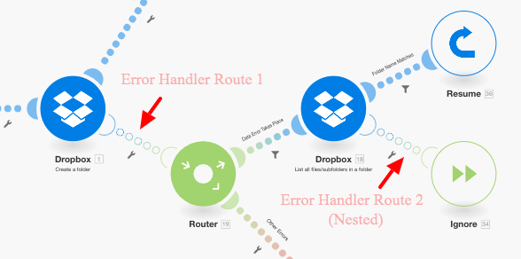

# 오류 처리 경로에 필터링 및 중첩 추가

필터링 및 중첩을 포함하여 오류 처리 경로에 고급 오류 처리 기술을 추가할 수 있습니다.

## 액세스 요구 사항

+++ 을 확장하여 이 문서의 기능에 대한 액세스 요구 사항을 봅니다.

이 문서의 기능을 사용하려면 다음 액세스 권한이 있어야 합니다.

<table style="table-layout:auto">
 <col> 
 <col> 
 <tbody> 
  <tr> 
   <td role="rowheader">Adobe Workfront 패키지 
   <td> 
임의
 </td> 
  </tr> 
  <tr data-mc-conditions=""> 
   <td role="rowheader">Adobe Workfront 라이선스</td> 
   <td> 
새로운 기능: 표준

또는

현재: 작업 시간 이상
 </td> 
  </tr> 
  <tr> 
   <td role="rowheader">Adobe Workfront Fusion 라이센스**</td> 
   <td>
   
현재: Workfront Fusion 라이선스 요구 사항 없음

   
또는

   
레거시: 모두 

   </td> 
  </tr> 
  <tr> 
   <td role="rowheader">제품</td> 
   <td>
   
신규:
 <ul><li>또는 Prime Workfront 플랜 선택: 귀사는 Adobe Workfront Fusion을 구매해야 합니다.</li><li>Ultimate Workfront 플랜: Workfront Fusion이 포함됩니다.</li></ul>
   
또는

   
현재: 조직은 Adobe Workfront Fusion을 구매해야 합니다.

   </td> 
  </tr>
 </tbody> 
</table>

이 표의 정보에 대한 자세한 내용은 설명서에서 [액세스 요구 사항](/help/workfront-fusion/references/licenses-and-roles/access-level-requirements-in-documentation.md)을 참조하십시오.

Adobe Workfront Fusion 라이선스에 대한 자세한 내용은 [Adobe Workfront Fusion 라이선스](/help/workfront-fusion/set-up-and-manage-workfront-fusion/licensing-operations-overview/license-automation-vs-integration.md)를 참조하십시오.

+++

## 필터링

오류 처리기 경로에서 수행할 수 있는 필터링에는 두 가지가 있습니다.

* [오류 처리기 경로에 필터 추가](#add-a-filter-to-the-error-handler-route)
* [오류 처리기 경로에 필터 뒤에 라우터 추가](#add-a-router-followed-by-filters-to-the-error-handler)

### 오류 처리기 경로에 필터 추가

필터를 사용하여 오류 처리기 경로에 의해 처리되는 오류를 제어할 수 있습니다. 이를 통해 특정 유형의 오류만 처리할 수 있습니다. 오류가 필터를 통과하지 않으면 해당 모듈에 대해 정의된 오류 처리기 경로가 없는 것처럼 처리됩니다.

이러한 필터는 Fusion의 다른 필터처럼 구성됩니다. 지침은 [시나리오에 필터 추가](/help/workfront-fusion/create-scenarios/add-modules/add-a-filter-to-a-scenario.md)를 참조하십시오.

### 오류 핸들러에 필터 뒤에 라우터 추가

오류 처리 경로에 라우터를 추가하면 오류 유형에 따라 다른 경로를 구성할 수 있습니다.

예를 들어, 오류가 DataError일 때 실행할 하나의 경로를 구성하려면 매핑된 오류 유형이 DataError와 동일한 경우 데이터를 전달할 수 있도록 하는 필터를 설정할 수 있습니다.

Fusion에서 다양한 데이터 형식을 평가하고 처리하는 방법에 대한 자세한 내용은 [오류 형식](/help/workfront-fusion/references/errors/error-processing.md)을 참조하십시오.

### 예: 필터를 사용한 오류 처리

>[!BEGINSHADEBOX]

이 예제 시나리오는 오류 처리에 대해 이러한 필터가 작동하는 방식을 보여 줍니다.

Dropbox > 폴더 모듈 만들기를 사용하는 경우 동일한 이름의 폴더가 이미 있으면 모듈에 DataError 가 발생합니다.

전체 시나리오는 다음과 같이 작동합니다.

1. 도구 > 변수 설정 모듈에는 폴더 이름이 포함되어 있습니다
1. HTTP > 파일 가져오기 모듈은 폴더에 업로드해야 하는 파일을 가져옵니다
1. Dropbox > 폴더 모듈 만들기에서 모듈에 매핑된 폴더와 동일한 이름의 폴더가 이미 있는 경우 오류가 발생합니다
1. 오류 처리기 경로(투명 버블)에 오류를 필터링할 라우터가 포함되어 있습니다
첫 번째 경로는 지정된 오류 유형(`DataError`)에 대한 것입니다.

   1. `DataError`이(가) 발생하고 오류 세부 정보가 필터를 통과하면 Dropbox >폴더 모듈에 있는 모든 파일/하위 폴더 나열 은(는) Dropbox의 모든 폴더를 나열합니다.
   1. 다음 필터는 폴더 이름과 일치합니다.
   1. **Resume** 지시문은 기존 폴더의 폴더 ID와 폴더 경로를 지정하며 Dropbox > 폴더 모듈 만들기에서 시나리오 실행이 다시 시작됩니다. 그러나 새 폴더를 만드는 대신 Fusion은 Resume 지시문의 값을 사용하여 다음 모듈로 이동하고 기존 폴더에 있는 파일을 업로드합니다.

1. 두 번째 경로는 다른 모든 오류에 대한 것이고 Rollback 지시문으로 종료되어 시나리오를 즉시 중지합니다

다음은 DataError 경로에 대한 자세한 설명입니다.

파일 업로드와 같은 후속 모듈의 기존 폴더를 사용하려면 모듈에 오류 처리기 경로를 추가하고 다음에 나오는 Resume 지시문 모듈에 매핑할 폴더 경로를 가져와야 합니다.

첫 번째 경로의 필터는 이름이 같은 폴더가 이미 있을 때 나타나는 특정 오류(DataError)만 처리하도록 설정됩니다.

Dropbox > 폴더 모듈의 모든 파일 나열 모듈은 대상 폴더의 모든 폴더를 반환하도록 구성됩니다. 다음 필터는 원래 만들려고 했던 필터만 전달합니다. 폴더 이름은 33에 저장됩니다. 폴더 이름 항목.)

그런 다음 Resume 지시문은 폴더 경로를 실패한 모듈에 대한 출력으로 제공합니다. 파일 업로드 모듈에서 폴더 ID가 필요하지 않으므로 이 ID를 비워 두었습니다.

>[!ENDSHADEBOX]

## 중첩

오류 처리기 경로는 라우터를 제외한 모든 모듈에서 만들고 구성할 수 있습니다. 따라서 기존 오류 처리기 경로에 이미 속해 있는 모듈에 대한 오류 처리기 경로를 만들 수 있습니다.

>[!BEGINSHADEBOX]

예:

필터를 사용한 중첩 오류 처리기 경로:

이 시나리오에서, 제2 오류 핸들러 경로는 제1 오류 핸들러 경로 아래에 중첩된다.

Dropbox > 폴더 모듈 만들기에서 오류가 발생하면 실행이 첫 번째 경로로 이동합니다. `DataError Takes Place` 필터가 전달되면 다음 모듈이 실행되고, Dropbox > 폴더 모듈의 모든 파일/하위 폴더 목록에 오류가 발생하지 않으면 Resume 지시문 모듈이 실행됩니다.

하지만 Dropbox > 폴더 모듈의 모든 파일/하위 폴더 목록에 오류가 발생하면 실행이 오류 처리기 Route 2로 이동하고 [!UICONTROL Ignore] 지시문으로 끝납니다. 이 경우 [!UICONTROL Resume 지시문] 모듈이 실행되지 않습니다.

>[!ENDSHADEBOX]
