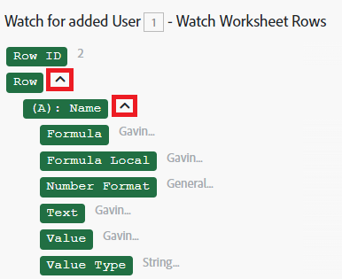

# 한 모듈에서 다른 모듈로 정보 매핑

매핑은 모듈의 출력을 다른 모듈의 입력 필드에 할당하는 프로세스입니다.

시나리오의 이전 모듈에서 출력된 값을 삽입할 수 있는 필드를 클릭하면 매핑 패널이 표시됩니다.

또한 매핑 패널에서 입력한 정적 텍스트가 있는 매핑된 항목과 함수의 조합을 사용하여 공식을 만들 수도 있습니다. 이러한 요소는 서로 내부에 중첩될 수 있습니다.

## 액세스 요구 사항

+++ 을 확장하여 이 문서의 기능에 대한 액세스 요구 사항을 봅니다.

이 문서의 기능을 사용하려면 다음 액세스 권한이 있어야 합니다.

<table style="table-layout:auto">
 <col> 
 <col> 
 <tbody> 
  <tr> 
   <td role="rowheader">Adobe Workfront 패키지</td> 
   <td> 
임의
 </td> 
  </tr> 
  <tr data-mc-conditions=""> 
   <td role="rowheader">Adobe Workfront 라이선스</td> 
   <td> 
새로운 기능: 표준

또는

현재: [!UICONTROL Work] 이상
 </td> 
  </tr> 
  <tr> 
   <td role="rowheader">Adobe Workfront Fusion 라이센스**</td> 
   <td>
   
현재: Workfront Fusion 라이센스 요구 사항이 없습니다.

   
또는

   
레거시: 모두 

   </td> 
  </tr> 
  <tr> 
   <td role="rowheader">제품</td> 
   <td>
   
신규:
 <ul><li>[!UICONTROL Select] 또는 [!UICONTROL Prime] Workfront 플랜: 조직에서 Adobe Workfront Fusion을 구매해야 합니다.</li><li>[!UICONTROL Ultimate] Workfront 계획: Workfront Fusion이 포함됩니다.</li></ul>
   
또는

   
현재: 조직은 Adobe Workfront Fusion을 구매해야 합니다.

   </td> 
  </tr>
 </tbody> 
</table>

이 표의 정보에 대한 자세한 내용은 설명서에서 [액세스 요구 사항](/help/workfront-fusion/references/licenses-and-roles/access-level-requirements-in-documentation.md)을 참조하십시오.

Adobe Workfront Fusion 라이선스에 대한 자세한 내용은 [Adobe Workfront Fusion 라이선스](/help/workfront-fusion/set-up-and-manage-workfront-fusion/licensing-operations-overview/license-automation-vs-integration.md)를 참조하십시오.

+++

## 항목 매핑

두 개 이상의 모듈을 연결하여 모듈 시퀀스를 만든 후 각 모듈은 그 앞에 오는 모듈에서 출력된 항목의 값을 처리할 수 있습니다.

모듈의 입력 필드에 출력 항목을 지정하려면 다음을 수행합니다.

1. 왼쪽 패널의 **[!UICONTROL 시나리오]** 탭을 클릭합니다.
1. 데이터를 매핑할 시나리오를 선택합니다.
1. 시나리오의 아무 곳이나 클릭하여 시나리오 편집기를 입력합니다.
1. 이전 모듈의 출력을 처리해야 하는 모듈을 클릭합니다.
1. 표시되는 모듈 설정 패널에서 이전 모듈에서 출력된 항목의 값을 사용할 필드를 클릭합니다.

   매핑 패널이 열립니다.

1. (선택 사항) 매핑 패널에서 특정 필드를 검색하려면 매핑 패널 검색 막대를 클릭하고 검색할 용어를 입력합니다. 목록에 나타날 때 필드를 클릭합니다.

   검색 결과에는 검색어가 포함되며 대/소문자를 구분하지 않습니다.
1. 컬렉션의 요소인 값을 선택하려면 해당 컬렉션 옆에 있는 화살표를 클릭한 다음, 표시될 때 요소를 선택합니다.

   

1. 매핑 패널에서 항목을 클릭하여 필드에 삽입합니다.

자세한 내용은 [모듈 구성](/help/workfront-fusion/create-scenarios/add-modules/configure-a-modules-settings.md)을 참조하세요.

## 문제 해결

### 문제: 매핑 패널에 누락된 항목

매핑 패널에는 이전 모듈의 출력 항목이 표시됩니다. 이 패널에서 일부 항목이 누락되는 경우가 있습니다. 시나리오 편집기에서 출력이 누락된 모듈을 실행할 수 있으며 그런 다음 매핑 패널에서 해당 항목을 이후 모듈에 포함할 수 있습니다. 정확한 절차는 모듈 유형에 따라 다릅니다

* [인스턴트 트리거](#instant-trigger)
* [폴링 트리거](#polling-trigger)
* [기타 모듈](#other-modules)

#### 인스턴트 트리거

1. 모듈을 마우스 오른쪽 단추로 클릭한 다음 표시되는 메뉴에서 **[!UICONTROL 이 모듈만 실행]**&#x200B;을 클릭합니다.

   이것은 즉각적인 트리거이므로 이벤트를 보기 시작합니다.

1. 모듈이 보고 있는 이벤트를 만듭니다.

   예를 들어 모듈이 작업 할당을 감시하는 Workfront > 이벤트 감시 모듈인 경우 Workfront(Fusion 연결에서 사용 중인 사용자가 아닌 사용자)에 로그인하여 작업을 할당합니다.

1. 모듈 실행이 완료되면 모듈 위의 버블을 클릭하여 전체 출력을 탐색합니다.

   이제 이후 모듈의 매핑 패널에 모듈의 출력에 있는 모든 항목이 포함됩니다.

#### 폴링 트리거

1. 모듈을 마우스 오른쪽 단추로 클릭한 다음 표시되는 메뉴에서 **[!UICONTROL 이 모듈만 실행]**&#x200B;을 클릭합니다.
1. 출력이 없으면 **[!UICONTROL 시작할 위치 선택]**&#x200B;을 클릭하고 설정을 조정하세요.
1. (조건부) 처리할 이벤트가 없는 경우 모듈이 감시하는 이벤트를 만들고 2단계를 반복합니다.

   예를 들어 모듈이 작업 할당을 감시하는 Workfront > 레코드 감시 모듈인 경우 Workfront(Fusion 연결에서 사용 중인 사용자가 아닌 사용자)에 로그인하여 작업을 할당한 다음 모듈을 다시 실행합니다.

1. 모듈 실행이 완료되면 모듈 위의 버블을 클릭하여 전체 출력을 탐색합니다.

   이제 이후 모듈의 매핑 패널에 모듈의 출력에 있는 모든 항목이 포함됩니다.

#### 기타 모듈

다음을 실행하도록 선택할 수 있습니다.

* 전체 시나리오(또는 모듈이 포함된 부분)입니다
* 단일 모듈

단일 모듈을 실행하려면

1. 모듈을 마우스 오른쪽 단추로 클릭한 다음 표시되는 메뉴에서 **[!UICONTROL 이 모듈만 실행]**&#x200B;을 클릭합니다.
1. 입력 항목에 대한 샘플 값을 입력한 다음 **[!UICONTROL 확인]** 을 클릭합니다.
1. 모듈 실행이 완료되면 모듈 위의 버블을 클릭하여 전체 출력을 탐색합니다.

   이제 이후 모듈의 매핑 패널에 모듈의 출력에 있는 모든 항목이 포함됩니다.
