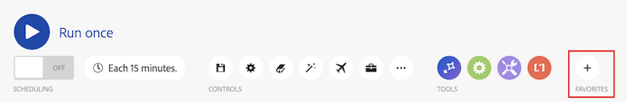

# 시나리오 편집기

시나리오 편집기를 사용하면 시각적 인터페이스에서 시나리오를 만들고 편집할 수 있습니다.

## 액세스 요구 사항

+++ 이 문서의 기능에 대한 액세스 요구 사항을 보려면 확장하십시오.

<table style="table-layout:auto">
 <col> 
 <col> 
 <tbody> 
  <tr> 
   <td role="rowheader">Adobe Workfront 패키지</td> 
   <td> 
모든 Adobe Workfront 워크플로 패키지 및 모든 Adobe Workfront 자동화 및 통합 패키지

Workfront Ultimate

Workfront Prime 및 Select 패키지 및 Workfront Fusion 추가 구매.
 </td> 
  </tr> 
  <tr data-mc-conditions=""> 
   <td role="rowheader">Adobe Workfront 라이선스</td> 
   <td> 
표준

작업 이상
 </td> 
  </tr> 
  <tr> 
   <td role="rowheader">제품</td> 
   <td>
   
조직에 Workfront 자동화 및 통합이 포함되지 않은 Select 또는 Prime Workfront 패키지가 있는 경우 Adobe Workfront Fusion을 구매해야 합니다.</li></ul>
   </td> 
  </tr>
 </tbody> 
</table>

이 테이블의 정보에 대한 자세한 내용은 [설명서의 액세스 요구 사항](/help/workfront-fusion/references/licenses-and-roles/access-level-requirements-in-documentation.md)을 참조하십시오.

+++

## 시나리오 편집기를 열고 모듈을 추가합니다.

1. 왼쪽 패널에서 **[!UICONTROL 시나리오]** 을 클릭합니다.
1. 물음표 아이콘 을 클릭한 다음 시작할 앱 또는 서비스를 찾아 클릭합니다. 모듈 구성에 대한 자세한 내용은 [모듈 구성](/help/workfront-fusion/create-scenarios/add-modules/configure-a-modules-settings.md)을 참조하십시오.

## 사용 가능한 시나리오 편집기 작업

### 시나리오 실행

| 액션 | 세부 사항 |
|----------|----------|
| 시나리오 테스트 실행 | 활성화하기 전에 시나리오가 예상대로 실행되는지 확인하십시오. 활성화되면 시나리오는 일정에 따라 실행됩니다. 모든 것이 예상대로 실행되지 않으면 [오류 처리 추가](/help/workfront-fusion/create-scenarios/config-error-handling/error-handling.md)를 참조하여 오류를 처리하는 방법을 알아보십시오. |

### 예약

| 액션 | 세부 사항 |
|----------|----------|
| 시나리오 예약 | 기본적으로 시나리오는 15분마다 실행됩니다. 활성화된 시나리오가 실행되는 시기와 빈도를 정의하여 이를 변경할 수 있습니다. Fusion 시나리오는 5분마다 실행되도록 예약할 수 있습니다. 자세한 내용은 [시나리오 예약](/help/workfront-fusion/create-scenarios/config-scenarios-settings/schedule-a-scenario.md)을 참조하십시오. |

### 컨트롤

이러한 컨트롤 중 일부를 보려면 컨트롤 영역에서 세 점 아이콘을 클릭해야 할 수 있습니다.

| 액션 | 세부 사항 |
|----------|----------|
| 저장합니다. 

 | 시나리오를 저장하면 나중에 액세스해야 하는 경우 3점 메뉴 아래에서 새 버전을 사용할 수 있습니다. 이전에 저장한 시나리오 버전은 60일 동안만 사용할 수 있습니다. |
| 시나리오 설정 

 | 시나리오 설정 패널에는 시나리오에 대한 고급 설정이 포함되어 있습니다. 사용 가능한 설정에 대한 자세한 내용은 [시나리오 설정 구성](/help/workfront-fusion/create-scenarios/config-scenarios-settings/configure-scenario-settings.md)을 참조하십시오. |
| 참고  

 | 시나리오에 대해 메모를 합니다. 다른 사용자는 시나리오에 있을 때 이러한 메모를 볼 수 있습니다. |
| 자동 정렬 

 | 시나리오에서 모듈을 자동 정렬합니다. |
| 검색 모듈   
 | 검색어를 입력하여 모듈을 찾은 다음 해당 모듈로 가져올 검색 결과를 클릭합니다. 모듈 이름, ID, 유형 또는 애플리케이션별로 검색할 수 있습니다. |
| 흐름 설명  
 
 | 움직이는 점이 시나리오를 통해 데이터가 이동하는 방식을 보여 주는 애니메이션을 봅니다. |
| DevTool 

 | DevTool을 사용하면 시나리오의 모든 수동 실행을 확인하고, 수행된 모든 작업을 검토하고, 수행된 모든 API 호출의 세부 정보를 볼 수 있습니다. 오류를 일으킨 모듈, 작업 또는 단일 응답을 확인하고 해당 지식을 사용하여 시나리오를 구체화할 수 있습니다. 자세한 내용은 [시나리오 디버그](/help/workfront-fusion/manage-scenarios/debug-a-scenario.md)를 참조하십시오. |
| 블루프린트 내보내기  
 
 | 현재 시나리오의 블루프린트를 내보냅니다. |
| 블루프린트 가져오기  
 
 | 이전에 내보낸 시나리오 블루프린트를 가져옵니다. |
| 이전 버전  
 
 | 이 시나리오의 이전 버전을 봅니다. |

### 도구

| 액션 | 세부 사항 |
|----------|----------|
| 흐름 제어 | 설정을 구성하여 데이터가 이동하는 방식을 제어합니다. 자세한 내용은 [링크 필요]를 참조하세요. |
| 도구 | 도구 섹션에는 시나리오를 향상시킬 수 있는 몇 가지 유용한 모듈이 포함되어 있습니다. 자세한 내용은 [링크 필요]를 참조하세요. |
| 텍스트 구문 분석기 | 텍스트 파서 도구를 사용하여 다른 시나리오 모듈에서 사용할 텍스트를 구문 분석합니다. 텍스트 파서는 연결할 필요가 없습니다. 자세한 내용은 [링크 필요]를 참조하세요. |

### 즐겨찾기

즐겨찾기 아이콘을 사용하여 자주 사용하는 모듈을 추가할 수 있습니다.

