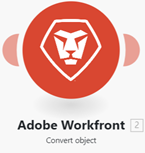

# Adobe Workfront Fusion 용어집

다음 용어집에서는 Adobe Workfront Fusion의 몇 가지 일반적인 용어에 대해 설명합니다.

<table style="table-layout:auto">
 <col> 
 <col> 
 <tbody> 
  <tr> 
   <td role="rowheader"> 
액션
 </td> 
   <td>선택한 앱 또는 서비스에서 또는 선택한 앱으로 데이터를 읽거나 쓰는 등의 작업을 수행할 수 있는 모듈입니다.</td> 
  </tr> 
  <tr> 
   <td role="rowheader"> 
집계
 </td> 
   <td> 
여러 번들(여러 데이터 컬렉션)을 하나의 번들로 병합하는 모듈 유형입니다. 

자세한 내용은 <a href="/help/workfront-fusion/references/modules/aggregator-module.md" class="MCXref xref">집계 모듈</a>을 참조하세요.
 </td> 
  </tr> 
  <tr> 
   <td role="rowheader">API</td> 
   <td>API(Application Programming Interface)는 애플리케이션과 서비스가 서로 통신하는 방법입니다. Fusion은 API를 사용하여 연결 중인 애플리케이션과 통신합니다. 각 애플리케이션에는 별도의 API가 있습니다. </td> 
  </tr> 
  <tr> 
   <td role="rowheader">API 키</td> 
   <td>소프트웨어 API를 호출하는 사용자, 개발자 또는 프로그램을 식별하는 고유한 코드로, 인증에 사용됩니다. Fusion 모듈은 API를 연결하여 작동하므로 API 키가 필요한 경우가 있습니다. API 키는 필요한 앱에 의해 배포됩니다. 예를 들어 Fusion을 Adobe Lightroom에 연결하기 위해 API 키가 필요한 경우 Adobe Lightroom 계정을 통해 요청합니다.</td> 
  </tr> 
  <tr> 
   <td role="rowheader">앱 또는 서비스</td> 
   <td> 
소프트웨어 응용 프로그램. Fusion은 해당 애플리케이션에 대한 전용 커넥터가 없어도 대부분의 애플리케이션에 연결할 수 있습니다.
 
앱은 반복자나 집계자와 같이 데이터를 조작하는 특수 함수가 될 수도 있습니다. 
 
서비스는 웹 API, 웹 페이지, 다른 유형의 서버(FTP, SMTP, IMAP) 등을 포함할 수 있는 데이터 소스입니다. 
  </td> 
  </tr> 
  <tr> 
   <td role="rowheader"> 
번들
 </td> 
   <td> 
번들은 모듈에서 반환하거나 받는 데이터의 기본 단위입니다. 예를 들어, 세 개의 레코드를 반환하는 검색 모듈은 각 레코드에 대해 하나씩, 세 개의 데이터 번들을 출력합니다. 번들은 항목으로 구성됩니다.
 </td> 
  </tr> 
  <tr>
   <td role="rowheader"> 
연결
 </td> 
   <td> 
연결은 주어진 서비스에 연결하기 위한 자격 증명 집합을 나타냅니다. 모든 모듈 내에서 연결을 구성한 다음 다른 모듈에서 해당 연결을 사용할 수 있습니다. Fusion에서 해당 자격 증명을 사용하여 모듈에 필요한 정보에 액세스할 수 있도록 모든 모듈에는 연결이 선택되어야 합니다. 

자세한 내용은 <a href="/help/workfront-fusion/get-started-with-fusion/understand-fusion/connection-overview.md" class="MCXref xref">연결 개요</a>를 참조하십시오.
 </td> 
  </tr> 
  <tr> 
   <td role="rowheader">커넥터</td> 
   <td>커넥터는 특정 애플리케이션에 대한 모듈 세트입니다. Workfront Fusion은 Workfront, Salesforce 및 Jira와 같은 많은 공통 작업 애플리케이션에 커넥터를 제공합니다.</td> 
  </tr> 
  <tr> 
   <td role="rowheader"> 
주기
 </td> 
   <td> 
주기는 시나리오 실행의 두 단계(작업 및 커밋)로 구성됩니다. 시나리오는 하나 이상의 사이클로 구성될 수 있다. 자세한 내용은 <a href="/help/workfront-fusion/references/scenarios/scenario-execution-cycles-phases.md" class="MCXref xref">시나리오 실행, 주기 및 단계</a>를 참조하십시오.
 </td> 
  </tr> 
  <tr> 
   <td role="rowheader"> 
데이터 저장소
 </td> 
   <td> 
데이터 저장소는 시나리오의 데이터를 저장하거나 개별 시나리오 또는 시나리오 실행 간에 데이터를 전송할 수 있습니다. 

자세한 내용은 <a href="/help/workfront-fusion/create-scenarios/map-data/data-stores.md" class="MCXref xref">데이터 저장소</a>를 참조하세요.
 </td> 
  </tr> 
  <tr> 
   <td role="rowheader"> 
필터
 </td> 
   <td> 
 필터를 두 모듈 간에 적용할 수 있으므로 특정 기준에 맞는 번들로만 작업할 수 있습니다. 적용할 수 있는 여러 가지 필터가 있습니다. 

자세한 내용은 <a href="/help/workfront-fusion/create-scenarios/add-modules/add-a-filter-to-a-scenario.md" class="MCXref xref">시나리오에 필터 추가</a>를 참조하십시오.
 </td> 
  </tr> 
  <tr> 
   <td role="rowheader"> 
ID 
 </td> 
   <td> 
번들을 고유하게 식별하는 데 사용되는 이름입니다. ID는 일반적으로 주어진 서비스에서 업데이트하거나 삭제할 번들을 구별하는 데 사용됩니다. ID는 이전 모듈의 출력에서 매핑될 수 있습니다.
 </td> 
  </tr> 
  <tr> 
   <td role="rowheader"> 
항목
 </td> 
   <td> 
번들의 일부입니다. 번들은 여러 항목으로 구성될 수 있습니다. 항목 유형에는 텍스트, 숫자, 부울(예/아니요), 날짜, 시간, 버퍼(이진 데이터), 컬렉션, 선택 메뉴, 배열 및 유효성 검사와 같은 여러 가지가 있습니다.

 자세한 내용은 <a href="/help/workfront-fusion/references/mapping-panel/data-types/item-data-types.md" class="MCXref xref">항목 데이터 형식</a>을 참조하세요.
 </td> 
  </tr>
  <tr> 
   <td role="rowheader"> 
반복자
 </td> 
   <td> 
데이터 번들(데이터 컬렉션)을 하나씩 가져와서 별도의 번들로 나눌 수 있는 모듈 유형입니다. 그런 다음 이러한 번들은 이후 모듈에서 개별적으로 처리할 수 있습니다. 

자세한 내용은 <a href="/help/workfront-fusion/references/modules/iterator-module.md" class="MCXref xref">[!UICONTROL Iterator] 모듈</a>을 참조하세요.
 </td> 
  </tr> 
  <tr> 
   <td role="rowheader"> 
모듈
 </td> 
   <td> 
연관된 앱 또는 서비스 내에서 레코드 생성과 같은 기능을 수행하는 시나리오 내의 단일 단계입니다.
 
각 앱 또는 서비스에는 요청에 응답하는 방식을 정의하는 다양한 모듈이 있습니다.
  
  
 
자세한 내용은 <a href="/help/workfront-fusion/get-started-with-fusion/understand-fusion/module-overview.md" class="MCXref xref">모듈 개요</a>를 참조하세요.
 </td> 
  </tr> 
  <tr> 
   <td role="rowheader"> 
작업
 </td> 
   <td> 
레코드 검색 또는 파일 업로드와 같이 모듈에서 수행되는 작업입니다.

자세한 내용은 <a href="/help/workfront-fusion/set-up-and-manage-workfront-fusion/licensing-operations-overview/operations-in-workfront-fusion.md" class="MCXref xref">작업</a>을 참조하세요.

  </tr> 
  <tr> 
   <td role="rowheader">공개/비공개 키</td> 
   <td>공개 및 개인 키는 데이터를 암호화하고 해독하는 데 사용됩니다. 공개 키를 배포할 수 있으며 공개 키를 가진 모든 사람이 데이터를 암호화할 수 있지만 개인 키만 해독할 수 있습니다. 마찬가지로 개인 키를 가진 사용자는 공개 키를 가진 모든 사람이 해독할 수 있는 데이터를 암호화할 수 있습니다. 개인 키 암호화는 데이터가 개인 키 소유자로부터 나왔음을 보장하며 데이터 소스의 유효성 검사 역할을 합니다.</td> 
  </tr> 
  <tr> 
   <td role="rowheader"> 
라우터
 </td> 
   <td>라우터를 사용하면 데이터를 복제하거나 시나리오에 새 경로를 추가하여 데이터의 경로를 재지정하고 다른 데이터 그룹을 별도로 처리할 수 있습니다.

 자세한 내용은 <a href="/help/workfront-fusion/create-scenarios/add-modules/router-module.md" class="MCXref xref">[!UICONTROL Router] 모듈</a>을 참조하세요.</td> 
  </tr> 
  <tr> 
   <td role="rowheader"> 
시나리오
 </td> 
   <td> 
사용자가 만든 일련의 자동화된 단계로, 각 단계는 모듈에 의해 표현되고 수행됩니다. 시나리오의 목적은 데이터를 이동하고 조작하는 것입니다.
 
  
 
 자세한 내용은 <a href="/help/workfront-fusion/get-started-with-fusion/understand-fusion/scenario-overview.md" class="MCXref xref">시나리오 개요</a>를 참조하십시오.
 </td> 
  </tr> 
  <tr> 
   <td role="rowheader"> 
시나리오 세그먼트
 </td> 
   <td> 
 시나리오 세그먼트는 모두 동일한 애플리케이션에 연결되는 일련의 모듈로 구성된 시나리오의 섹션입니다. 시나리오 세그먼트는 종종 애플리케이션에서 짧은 워크플로우를 나타냅니다.
 </td> 
  </tr> 
  <tr> 
   <td role="rowheader"> 
트리거
 </td> 
   <td> 
트리거는 새로운 데이터와 업데이트된 데이터를 관찰하고 모듈에 구성된 특정 조건이 적용되면 시나리오를 시작하는 일종의 모듈입니다. 트리거는 일정에 따라(폴링) 또는 데이터 변경이 발생할 때마다(즉시 트리거 또는 웹후크) 시나리오를 시작하도록 구성할 수 있습니다.
 
자세한 내용은 모듈 개요 문서에서 <a href="/help/workfront-fusion/get-started-with-fusion/understand-fusion/module-overview.md" class="MCXref xref">트리거</a>를 참조하십시오.
 </td> 
  </tr> 
  <tr> 
   <td role="rowheader"> 
Webhook
 </td> 
   <td> 
새 번들을 사용할 수 있는 직후 시나리오를 실행할 수 있는 특수 유형의 트리거입니다. 

자세한 내용은 <a href="/help/workfront-fusion/references/modules/webhooks-reference.md" class="MCXref xref">인스턴트 트리거(웹후크)</a>를 참조하십시오.
 </td> 
  </tr> 
 </tbody> 
</table>
