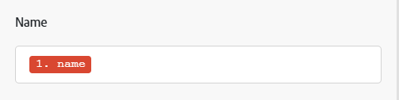

# 매핑 개요

매핑은 모듈의 출력을 다른 모듈의 입력 필드에 할당하는 프로세스입니다.

모듈의 작동은 출력으로 0개, 1개 또는 그 이상의 번들을 생성합니다. 번들은 하나 이상의 항목으로 구성됩니다.

이러한 항목을 이후 모듈의 필드에 매핑할 수 있습니다.

시나리오에서 이전 모듈에서 출력된 값을 삽입할 수 있는 필드를 클릭하면 매핑 패널이 표시됩니다. 여기에서 매핑할 항목을 선택할 수 있습니다. 매핑은 다음 중 하나 이상을 포함할 수 있습니다.

* 단일 항목
* 여러 항목
* 정적 텍스트
* 함수

>[!BEGINSHADEBOX]

**예**:

단일 항목

텍스트가 있는 여러 항목

여러 항목 및 텍스트가 있는 함수

>[!ENDSHADEBOX]

매핑에 대한 지침은 [맵 데이터: 문서 인덱스](/help/workfront-fusion/create-scenarios/map-data/map-data-toc.md)의 문서를 참조하십시오.

>[!NOTE]
>
>[!UICONTROL Iterator]과(와) [!UICONTROL Aggregator] 사이에 래핑된 모듈의 출력은 [!UICONTROL Aggregator] 모듈 외부에서 액세스할 수 없습니다.

## 매핑 패널

데이터를 매핑할 수 있는 필드를 클릭하면 매핑 패널이 열립니다.

첫 번째 탭 에는 다른 모듈에서 매핑할 수 있는 항목이 표시됩니다.

다른 탭에는 수식을 만드는 데 사용할 수 있는 함수, 연산자 및 키워드가 포함되어 있습니다. 이 탭은 처리하는 데이터 유형에 따라 서로 다른 탭으로 정렬됩니다.

함수 탭에 대한 자세한 내용은 [함수 개요](/help/workfront-fusion/get-started-with-fusion/understand-fusion/function-overview.md)를 참조하십시오.

함수를 사용한 항목 매핑에 대한 자세한 내용은 [함수를 사용한 항목 매핑](/help/workfront-fusion/create-scenarios/map-data/map-using-functions.md)을 참조하십시오.

## 컬렉션

항목에는 다양한 유형의 여러 값이 포함될 수 있습니다. 컬렉션 유형 항목입니다.

컬렉션 형식 번들은 모듈 출력의 번들 레이블 옆에 `(Collection)`을(를) 표시합니다.

대부분의 경우 전체 컬렉션을 나타내는 항목을 매핑하는 대신 컬렉션의 요소를 매핑합니다.

매핑 패널에서 컬렉션의 요소를 찾으려면 컬렉션 옆에 있는 화살표를 클릭합니다.

컬렉션에 대한 자세한 내용은 [항목 데이터 형식](/help/workfront-fusion/references/mapping-panel/data-types/item-data-types.md)을 참조하세요.

컬렉션 매핑에 대한 지침은 문서 [모듈 간 정보 매핑]에서 [항목 매핑](/help/workfront-fusion/create-scenarios/map-data/map-data-from-one-to-another.md#map-an-item)을 참조하십시오.

## 배열

항목은 동일한 유형의 여러 값을 포함할 수 있습니다. 배열 유형 항목입니다.

배열 형식 번들은 모듈 출력의 번들 레이블 옆에 `(Array)`을(를) 표시합니다.

매핑 패널에서 배열은 대괄호로 표시됩니다. 항목 레이블 끝에 있는 대괄호로 배열 유형 항목을 식별할 수 있습니다. 매핑 패널에서 특정 배열 요소를 찾으려면 배열 옆에 있는 화살표를 클릭합니다.

배열 및 배열 요소 매핑에 대한 정보 및 지침은 [배열 및 배열 요소 매핑](/help/workfront-fusion/create-scenarios/map-data/map-an-array.md)을 참조하십시오.
