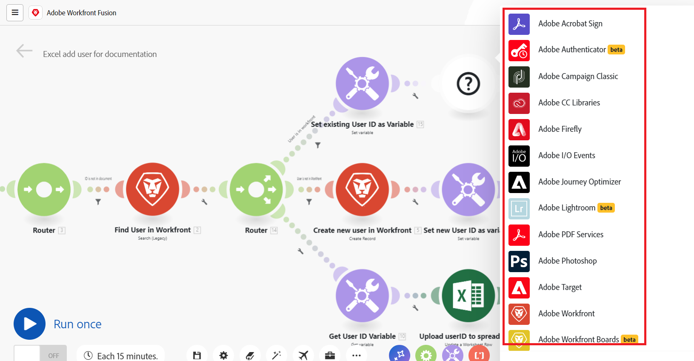

# 시나리오 개요

Adobe Workfront Fusion의 역할은 사용자가 일상적인 작업에 많은 시간을 할애할 필요가 없도록 프로세스를 자동화하는 것입니다. 데이터를 자동으로 전송하고 변환하는 시나리오를 만들기 위해 앱과 서비스 내에서 그리고 앱과 서비스 간에 액션을 연결하는 방식입니다. 생성한 시나리오는 앱이나 서비스의 데이터를 관찰하고 해당 데이터를 처리하여 원하는 결과를 제공합니다.

시나리오는 앱 내에서 데이터를 변환하거나 앱과 웹 서비스 간에 전송하는 방법을 나타내는 일련의 모듈로 구성됩니다.

## 시나리오 요소 개요

시나리오는 다양한 요소로 구성됩니다. 이러한 요소들의 용어를 이해하면 설명서를 더 쉽게 사용할 수 있습니다.

* [시나리오](#scenario)
* [트리거](#trigger)
* [모듈](#module)
* [경로](#route)
* [시나리오 세그먼트](#scenario-segment)
* [커넥터](#connector)

### 시나리오

**시나리오**&#x200B;는 데이터를 이동하고 조작하기 위해 사용자가 만든 일련의 자동화된 단계입니다. “시나리오”라는 용어는 연결된 전체 단계 그룹을 의미합니다.

### 트리거

시나리오는 **트리거**&#x200B;로 시작됩니다. 트리거는 새로운 데이터 및 업데이트된 데이터를 확인하고, 모듈에 구성된 특정 조건이 적용되면 시나리오를 시작합니다. 트리거는 일정에 따라 시나리오를 시작하도록 설정하거나(폴링), 데이터 변경이 발생할 때마다(인스턴트)로 설정할 수 있습니다.

### 모듈

트리거 뒤에는 여러 **모듈**&#x200B;이 이어집니다. 모듈은 특정 액션을 수행하는 시나리오에서 단일 단계를 나타냅니다. 모듈은 시나리오를 만들기 위해 구성되고 함께 연결됩니다.

### 경로

시나리오는 **경로**&#x200B;로 나눌 수 있습니다. 경로는 주어진 데이터 번들에 사용될 수도 있고 사용되지 않을 수도 있는 시나리오의 한 섹션입니다. 경로는 라우터 모듈과 필터를 사용하여 설정됩니다.

### 시나리오 세그먼트

시나리오 세그먼트는 동일한 애플리케이션에 연결되는 일련의 연속적인 모듈로 구성된 시나리오의 한 섹션입니다. 시나리오 세그먼트는 종종 애플리케이션에서 짧은 워크플로를 나타냅니다.

### 커넥터

커넥터는 특정 애플리케이션을 위한 모듈 세트입니다. Workfront Fusion은 Workfront, Salesforce, Jira와 같은 많은 일반적인 업무 애플리케이션과 모든 웹 서비스에 사용할 수 있는 범용 커넥터를 제공합니다.

## 예

다음 섹션을 확장하여 예시 시나리오와 그 설명을 확인하십시오.

+++**Adobe Workfront 내 프로세스 자동화**

Workfront Fusion을 사용하면 Workfront 내에서 간단하고 복잡한 워크플로를 자동화하여 시간을 절약하고 프로세스가 일관되게 실행되도록 할 수 있습니다.

이 예제에서는 Workfront의 작업 또는 문제에서 특정 필드가 변경될 때 시나리오가 트리거됩니다. 시나리오가 트리거되면 관련 프로젝트에서 정보를 가져오고 프로젝트의 특정 역할에 할당된 사용자를 위한 맞춤형 업데이트를 만듭니다.

+++

+++**다른 앱 또는 웹 서비스에 Workfront 연결**

>[!NOTE]
>
>조직에서 이전 라이선스 모델을 사용하는 경우, 다른 애플리케이션에 연결하려면 작업 자동화 및 통합을 위한 Workfront Fusion 라이선스가 있어야 합니다.

Workfront Fusion은 다른 애플리케이션 및 웹 서비스에 연결할 수 있습니다. 다른 애플리케이션에서 데이터를 접근, 가져오기, 조작 또는 내보내기할 수 있으며, 이를 Workfront와 또는 서로 통합할 수 있습니다.

많은 애플리케이션에는 전용 Workfront Fusion 커넥터가 있습니다. 액세스할 애플리케이션에 전용 커넥터가 없는 경우 Workfront Fusion의 HTTP 또는 SOAP 모듈을 사용하여 API를 통해 애플리케이션에 연결할 수 있습니다.

이 예제에서 시나리오는 사용자가 [!DNL Excel] 스프레드시트에 추가될 때 트리거됩니다. 시나리오는 사용자가 Workfront에 있는지 여부를 확인합니다. 그렇지 않은 경우 시나리오는 Workfront에서 사용자를 만들고 Workfront 사용자 ID를 스프레드시트에 다시 추가합니다.

전용 커넥터 목록은 [Fusion 애플리케이션 및 해당 모듈 참조: 문서 인색](/help/workfront-fusion/references/apps-and-modules/apps-and-modules-toc.md)을 참조하십시오.

>[!IMPORTANT]
>
>Adobe Workfront Fusion은 거의 모든 웹 서비스에 연결할 수 있습니다. 작업할 앱에 전용 Workfront Fusion 커넥터가 없는 경우 범용 커넥터를 사용하여 앱이나 서비스에 연결할 수 있습니다.
>
>범용 커넥터 목록은 [범용 커넥터](/help/workfront-fusion/references/apps-and-modules/apps-and-modules-toc.md#universal-connectors)를 참조하십시오.

+++

## 참조

* Workfront Fusion에 사용되는 용어는 [Adobe Workfront Fusion 용어](/help/workfront-fusion/get-started-with-fusion/understand-fusion/fusion-glossary.md)를 참조하십시오.
* 연습 시나리오를 만들려면 [기본 시나리오 만들기](/help/workfront-fusion/build-practice-scenarios/create-basic-scenario.md)를 참조하십시오.
* 시나리오 만들기 및 관리에 대한 자세한 내용은 아래에 나열된 문서를 참조하십시오.
   * [시나리오 만들기](/help/workfront-fusion/create-scenarios/create-scenarios-toc.md)
   * [시나리오 관리](/help/workfront-fusion/manage-scenarios/manage-scenarios-toc.md)
