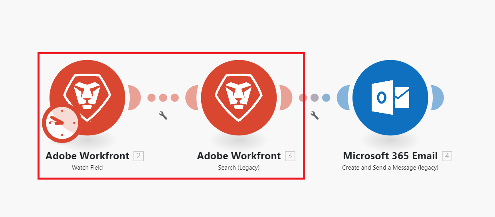

# 시나리오 개요

Adobe Workfront Fusion의 역할은 사용자가 일상적인 작업에 많은 시간을 소비하지 않도록 프로세스를 자동화하는 것입니다. 앱과 서비스 내 및 간의 작업을 연결하여 데이터를 자동으로 전송하고 변환하는 시나리오를 만듭니다. 앱 또는 서비스에서 데이터에 대한 시계를 만들고 해당 데이터를 처리하여 원하는 결과를 제공하는 시나리오입니다.

시나리오는 앱 내에서 데이터를 변환하거나 앱과 웹 서비스 간에 데이터를 전송하는 방법을 나타내는 일련의 모듈로 구성됩니다.

## 시나리오 요소 개요

시나리오는 서로 다른 요소로 구성됩니다. 이러한 요소의 용어를 이해하면 설명서를 더 쉽게 사용할 수 있습니다.

* [시나리오](#scenario)
* [트리거](#trigger)
* [모듈](#module)
* [경로](#route)
* [시나리오 세그먼트](#scenario-segment)
* [커넥터](#connector)

### 시나리오

**시나리오**&#x200B;은(는) 데이터를 이동하고 조작할 수 있도록 사용자가 만든 일련의 자동화된 단계입니다. &quot;시나리오&quot;라는 용어는 연결된 단계의 전체 그룹을 나타냅니다.

### 트리거

시나리오는 **trigger**(으)로 시작됩니다. 트리거는 새 데이터 및 업데이트된 데이터를 감시하고 모듈에 구성된 특정 조건이 적용되면 시나리오를 시작합니다. 트리거는 일정에 따라(폴링) 또는 데이터 변경이 발생할 때마다(즉시) 시나리오를 시작하도록 구성할 수 있습니다.

### 모듈

트리거 뒤에는 여러 **모듈**&#x200B;이(가) 옵니다. 모듈은 특정 작업을 수행하는 시나리오에서 단일 단계를 나타냅니다. 시나리오를 만들기 위해 모듈이 구성되고 함께 체인 처리됩니다.

### 경로

시나리오는 **경로**(으)로 나뉠 수 있습니다. 경로는 주어진 데이터 번들에 대해 사용되거나 사용되지 않을 수 있는 시나리오의 섹션이다. 라우터는 라우터 모듈과 필터를 사용하여 설정합니다.

### 시나리오 세그먼트

시나리오 세그먼트는 모두 동일한 애플리케이션에 연결되는 일련의 연속 모듈로 구성된 시나리오의 섹션입니다. 시나리오 세그먼트는 종종 애플리케이션에서 짧은 워크플로우를 나타냅니다.

### 커넥터

커넥터는 특정 애플리케이션에 대한 모듈 세트입니다. Workfront Fusion은 Workfront, Salesforce 및 Jira와 같은 많은 공통 작업 애플리케이션에 대한 커넥터와 모든 웹 서비스에 사용할 수 있는 일반 커넥터를 제공합니다.

## 예시

다음 섹션을 확장하여 예제 시나리오와 해당 설명을 봅니다.

+++**Adobe Workfront에서 프로세스 자동화**

Workfront Fusion을 사용하면 Workfront 내에서 간단하거나 복잡한 워크플로우를 자동화하여 시간을 절약하고 프로세스가 일관되게 실행되도록 할 수 있습니다.

이 예제에서 시나리오는 Workfront의 작업 또는 문제에서 지정된 필드가 변경될 때 트리거됩니다. 시나리오가 트리거되면 관련 프로젝트에서 정보를 가져오고 프로젝트의 특정 역할에 할당된 사용자에 대해 맞춤 업데이트를 만듭니다.

+++

+++**다른 앱 또는 웹 서비스에 Workfront 연결**

>[!NOTE]
>
>조직에서 레거시 라이선스 모델을 사용하는 경우 다른 애플리케이션에 연결하려면 조직에 작업 자동화 및 통합용 Workfront Fusion 라이선스가 있어야 합니다.

Workfront Fusion을 다른 애플리케이션 및 웹 서비스에 연결할 수 있습니다. 다른 애플리케이션에서 데이터를 Workfront 또는 서로 통합하여 액세스, 가져오기, 조작 또는 내보낼 수 있습니다.

많은 애플리케이션에 전용 Workfront Fusion 커넥터가 있습니다. 액세스하려는 애플리케이션에 대한 전용 커넥터가 없는 경우 Workfront Fusion의 HTTP 또는 SOAP 모듈을 사용하여 해당 API를 통해 애플리케이션에 연결할 수 있습니다.

이 예제에서는 사용자가 [!DNL Excel] 스프레드시트에 추가되면 시나리오가 트리거됩니다. 시나리오는 사용자가 Workfront에 있는지 여부를 확인합니다. 없는 경우 시나리오에서는 Workfront에서 사용자를 만들고 Workfront 사용자 ID를 스프레드시트에 다시 추가합니다.

전용 커넥터 목록을 보려면 [Fusion 응용 프로그램 및 해당 모듈 참조: 문서 인덱스](/help/workfront-fusion/references/apps-and-modules/apps-and-modules-toc.md)를 참조하십시오.

>[!IMPORTANT]
>
>Adobe Workfront Fusion은 거의 모든 웹 서비스에 연결할 수 있습니다. 작업할 앱에 전용 Workfront Fusion 커넥터가 없는 경우 범용 커넥터를 사용하여 앱 또는 서비스에 연결합니다.
>
>범용 커넥터 목록은 [범용 커넥터](/help/workfront-fusion/references/apps-and-modules/apps-and-modules-toc.md#universal-connectors)를 참조하십시오.

+++

## 참조

* Workfront Fusion에 사용되는 용어집은 [Adobe Workfront Fusion 용어집](/help/workfront-fusion/get-started-with-fusion/understand-fusion/fusion-glossary.md)을 참조하십시오.
* 연습 시나리오를 만들려면 [기본 시나리오 만들기](/help/workfront-fusion/build-practice-scenarios/create-basic-scenario.md)를 참조하십시오.
* 시나리오 생성 및 관리에 대한 자세한 내용은 아래 나열된 문서를 참조하십시오.
   * [시나리오 만들기](/help/workfront-fusion/create-scenarios/create-scenarios-toc.md)
   * [시나리오 관리](/help/workfront-fusion/manage-scenarios/manage-scenarios-toc.md)
