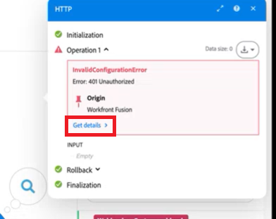

# 시나리오 디버그

Adobe Workfront Fusion Devtool을 사용하면 시나리오를 이해하고 문제를 해결할 수 있습니다. Devtool을 사용하면 시나리오의 모든 수동 실행을 확인하고, 수행된 모든 작업을 검토하고, 수행된 모든 API 호출의 세부 정보를 볼 수 있습니다. 오류를 일으킨 모듈, 작업 또는 단일 응답을 확인하고 해당 지식을 사용하여 시나리오를 구체화할 수 있습니다.

>[!NOTE]
>
>비밀 시나리오, 자동 실행 및 성공적인 작업에 대해 디버거 패널의 로깅이 제한되거나 사용할 수 없습니다.

비디오 소개 및 Fusion Devtool에 대한 설명은

* [Fusion 개발 도구](https://video.tv.adobe.com/v/3427031/){target=_blank}
* [Devtool 연습](https://experienceleague.adobe.com/docs/workfront-learn/tutorials-workfront/fusion/troubleshooting-and-error-handling/dev-tool-walkthrough.html?lang=ko)

## 액세스 요구 사항

+++ 을 확장하여 이 문서의 기능에 대한 액세스 요구 사항을 봅니다.

<table style="table-layout:auto">
 <col> 
 <col> 
 <tbody> 
  <tr> 
   <td role="rowheader">Adobe Workfront 패키지</td> 
   <td> 
모든 Adobe Workfront 워크플로 패키지 및 모든 Adobe Workfront 자동화 및 통합 패키지

Workfront Ultimate

Workfront Prime 및 Select 패키지 및 Workfront Fusion 추가 구매.
 </td> 
  </tr> 
  <tr data-mc-conditions=""> 
   <td role="rowheader">Adobe Workfront 라이선스</td> 
   <td> 
표준

작업 이상
 </td> 
  </tr> 
  <tr> 
   <td role="rowheader">제품</td> 
   <td>
   
조직에 Workfront 자동화 및 통합이 포함되지 않은 Select 또는 Prime Workfront 패키지가 있는 경우 조직에서 Adobe Workfront Fusion을 구매해야 합니다.</li></ul>
   </td> 
  </tr>
 </tbody> 
</table>

이 표의 정보에 대한 자세한 내용은 설명서에서 [액세스 요구 사항](/help/workfront-fusion/references/licenses-and-roles/access-level-requirements-in-documentation.md)을 참조하십시오.

+++

## 개발자 도구 액세스

Adobe 통합 쉘에서 Fusion을 사용하거나 새 Fusion 경험으로 업데이트한 경우 시나리오 편집기에서 Devtool에 액세스할 수 있습니다.

1. 화면 하단 근처에 있는 **도우미 도구**  아이콘을 클릭합니다.

또는:

1. 디버그하려는 시나리오의 시나리오 편집기로 이동합니다.

   시나리오 편집기를 찾으려면 [시나리오 편집기](/help/workfront-fusion/get-started-with-fusion/navigate-fusion/scenario-editor.md)를 참조하십시오.

1. 모듈이 아닌 페이지의 빈 영역을 마우스 오른쪽 버튼으로 클릭합니다.
1. **Devtool 열기**&#x200B;를 선택합니다.

## Workfront Fusion Devtool 사용

Workfront Fusion Devtool은 3개의 기본 섹션으로 나뉩니다. Devtool 창의 왼쪽 패널에서 찾을 수 있습니다.

* [라이브 스트림](#live-stream)
* [시나리오 디버거](#scenario-debugger)
* [도구](#tools)

### 라이브 스트림

시나리오에서 한 번 실행 을 클릭하면 백그라운드에서 발생하는 상황이 라이브 스트림에 표시됩니다.

1. **[!UICONTROL 라이브 스트림]** 아이콘 을 클릭하여 라이브 스트림 섹션을 엽니다.
1. 다음 중 하나를 수행합니다.

   <table style="table-layout:auto"> 
    <col> 
    <col> 
    <thead> 
     <tr> 
      <th>액션</th> 
      <th>지침</th> 
     </tr> 
    </thead> 
    <tbody> 
     <tr> 
      <td role="rowheader">요청 정보 보기</td> 
      <td> 
시나리오의 각 모듈에 대한 다음 정보를 볼 수 있습니다
 
       <ul> 
        <li> 
요청 헤더(API 끝점 URL, http 메서드, 요청이 호출된 시간 및 날짜, 요청 헤더 및 쿼리 문자열)
 </li> 
        <li> 
요청 본문
 </li> 
        <li> 
응답 헤더
 </li> 
        <li> 
응답 본문
 </li> 
       </ul> 
이 정보를 보려면 Workfront Fusion Devtool의 오른쪽 패널에서 해당 탭을 클릭합니다.
 </td> 
     </tr> 
     <tr> 
      <td role="rowheader"> 
컨텐츠별로 이벤트 검색
 </td> 
      <td> 
Workfront Fusion Devtool의 왼쪽 패널에 있는 검색 필드에 검색어를 입력하여 검색어가 포함된 요청만 표시합니다.
 </td> 
     </tr> 
     <tr> 
      <td role="rowheader"> 
요청 목록 지우기 
 </td> 
      <td> 
Devtool의 왼쪽 패널 오른쪽 위 모서리에 있는 휴지통 아이콘을 클릭하여 Workfront Fusion Devtool에서 기록한 요청 목록을 지웁니다. 
 </td> 
     </tr> 
     <!--<tr> 
      <td role="rowheader"> 
Enable Console Logging
 </td> 
      <td> 
Click the computer icon  in the top-right corner of the Devtool's left panel.
 
Logging in the console is enabled when the computer icon is green.
 </td> 
     </tr>-->
     <tr> 
      <td role="rowheader"> 
원시 JSON 형식 또는 cURL로 요청 검색
 </td> 
      <td> 
       <ul> 
        <li> 
<strong>원시 JSON</strong> 
 
Devtool 오른쪽 창의 오른쪽 위 모서리에 있는 <strong>[!UICONTROL Copy RAW]</strong>을(를) 클릭합니다.
 </li> 
        <li> 
<strong>cURL</strong> 
 
Devtool 오른쪽 창의 오른쪽 위 모서리에서 <strong>[!UICONTROL Copy cURL]</strong>을(를) 클릭합니다.
 </li> 
       </ul> </td> 
     </tr> 
    </tbody> 
   </table>

### 시나리오 디버거

>[!NOTE]
>
>오류가 발생한 시나리오에서 빠르게 디버거로 이동하려면 모듈 출력의 오류 메시지에서 **세부 정보 가져오기**&#x200B;를 클릭합니다.
>
>

시나리오 디버거는 보다 복잡한 시나리오에 유용합니다. 시나리오 실행 기록이 표시되며, 이를 사용하여 모듈 이름이나 ID로 모듈을 검색할 수 있습니다.

1. **[!UICONTROL 시나리오 디버거]** 아이콘 을 클릭하여 시나리오 디버거를 엽니다.
1. (선택 사항) 검색 필드에 검색어(이름 또는 모듈 ID)를 입력합니다.
1. 모듈 이름을 클릭합니다.
1. 요청 세부 사항을 보려면 작업을 클릭합니다.

### 도구

Workfront Fusion Devtool에는 시나리오를 보다 쉽게 설정할 수 있는 도구가 포함되어 있습니다.

1. **[!UICONTROL 도구]** 아이콘 을 클릭하여 도구를 엽니다.
1. 사용할 도구를 선택합니다
1. 아래에 자세히 설명된 대로 필드를 구성합니다.
1. **[!UICONTROL 실행]**&#x200B;을 클릭합니다.

도구 및 해당 필드:

* [모듈에 포커스](#focus-a-module)
* [매핑으로 모듈 찾기](#find-modules-by-mapping)
* [앱 메타데이터 가져오기](#get-app-metadata)
* [매핑 복사](#copy-mapping)
* [필터 복사](#copy-filter)
* [모듈 이름 복사](#copy-module-name)
* [연결 교체](#swap-connection)
* [변수 교체](#swap-variable)
* [기본 64](#base-64)
* [Source 다시 매핑](#remap-source)

#### [!UICONTROL 모듈에 포커스]

지정된 모듈의 설정을 ID로 엽니다.

<table style="table-layout:auto">
    <tr>
        <td>[!UICONTROL 모듈 ID]</td>
        <td>설정을 열려면 모듈의 ID를 입력하십시오.</td>
    </tr>
</table>

#### [!UICONTROL 매핑으로 모듈 찾기]

지정된 용어에 대한 모듈 값을 검색할 수 있습니다. 출력에는 검색한 용어가 포함된 모듈의 ID가 포함됩니다.

<table style="table-layout:auto">
 <col> 
 <col> 
 <tbody> 
  <tr> 
   <td role="rowheader">[!UICONTROL 키워드]</td> 
   <td> 
 검색할 용어를 입력합니다. 
 </td> 
  </tr> 
  <tr> 
   <td role="rowheader"> 
[!UICONTROL 값만 사용]
 </td> 
   <td> 
모듈 필드의 값만 검색하려면 이 옵션을 활성화하십시오.
 
모듈 필드 이름에서도 검색하려면 이 옵션을 비활성화하십시오.
 
이름 및 레이블 매개 변수를 통해 검색이 수행됩니다.
 </td> 
  </tr> 
 </tbody> 
</table>

#### [!UICONTROL 앱 메타데이터 가져오기]

앱의 모듈 이름 또는 ID로 앱의 메타데이터를 검색합니다. 이 기능은 예를 들어 시나리오에 사용된 앱의 버전을 알고 있어야 할 때 유용합니다.

<table style="table-layout:auto">
    <tr>
        <td>[!UICONTROL Source Module]</td>
        <td>메타데이터를 검색할 모듈을 선택합니다.</td>
    </tr>
</table>

#### [!UICONTROL 매핑 복사]

소스 모듈에서 대상 모듈로 값을 복사합니다.

>[!CAUTION]
>
>올바른 소스 및 대상 모듈을 설정했는지 확인하십시오. 다른 유형의 모듈을 선택하면 대상 모듈의 값이 삭제됩니다.

<table style="table-layout:auto">
 <col> 
 <col> 
 <tbody> 
  <tr> 
   <td role="rowheader">[!UICONTROL Source Module]</td> 
   <td> 
 모듈을 선택하거나 필드 값을 복사할 대상 모듈의 ID를 입력합니다.
 </td> 
  </tr> 
  <tr> 
   <td role="rowheader"> 
[!UICONTROL Target Module]
 </td> 
   <td> 
모듈을 선택하거나 소스 모듈 값을 삽입할 모듈의 ID를 입력합니다.
 
중요: 대상 모듈의 값을 덮어씁니다.
 </td> 
  </tr> 
 </tbody> 
</table>

#### [!UICONTROL 필터 복사]

소스 모듈에서 대상 모듈로 필터 설정을 복사합니다.

>[!NOTE]
>
>선택한 모듈의 왼쪽에 배치된 필터에서 복사 작업이 수행됩니다.

<table style="table-layout:auto"> 
 <col> 
 <col> 
 <tbody> 
  <tr> 
   <td role="rowheader">[!UICONTROL Source Module]</td> 
   <td> 
 모듈을 선택하거나 필터 값을 복사할 원본 모듈의 ID를 입력합니다.
 </td> 
  </tr> 
  <tr> 
   <td role="rowheader"> 
[!UICONTROL Target Module]
 </td> 
   <td> 
모듈을 선택하거나 소스 모듈의 필터 값을 삽입할 모듈의 ID를 입력합니다.
 
중요: 대상 모듈의 값을 덮어씁니다.
 </td> 
  </tr> 
  <tr> 
   <td role="rowheader"> 
[!UICONTROL 대체 경로 설정 유지]
 </td> 
   <td> 
원본 필터는 대체 경로로 설정됩니다. 대상 필터가 대체 경로로 설정되도록 설정하려면 이 옵션을 활성화하십시오.
 </td> 
  </tr> 
 </tbody> 
</table>

#### [!UICONTROL 모듈 이름 복사]

선택한 모듈의 이름을 클립보드에 복사합니다.

<table style="table-layout:auto">
 <col> 
 <col> 
 <tbody> 
  <tr> 
   <td role="rowheader">[!UICONTROL Module] </td> 
   <td> 
이름을 복사할 모듈을 선택합니다.
 </td> 
  </tr> 
 </tbody> 
</table>

#### [!UICONTROL 연결 교체]

소스 모듈에서 동일한 앱의 시나리오에 있는 모든 모듈로 연결을 복제합니다.

<table style="table-layout:auto">
    <tr>
        <td>[!UICONTROL Source Module]</td>
        <td>모듈을 선택하거나 연결을 복제할 모듈의 ID를 입력합니다.</td>
    </tr>
</table>

#### [!UICONTROL 변수 교체]

시나리오에서 지정된 변수를 검색하고 새 변수로 바꿉니다.

<table style="table-layout:auto">
 <col> 
 <col> 
 <tbody> 
  <tr> 
   <td role="rowheader">[!UICONTROL Variable to Find]</td> 
   <td> 
 시나리오의 변수 모듈에서 바꿀 변수 알약을 찾아 이 ([!UICONTROL Variable to Find]) 필드에 복사합니다. 필드에는 이중 중괄호가 표시됩니다. 예: <code>&#123;&#123;5.value&#125;&#125;</code>.
 </td> 
  </tr> 
  <tr> 
   <td role="rowheader"> 
[!UICONTROL 다음으로 바꾸기]
 </td> 
   <td> 
시나리오의 변수 모듈에서 변수를 로 바꿀 변수 알약을 찾아 이 ([!UICONTROL Variable to Find]) 필드에 복사합니다. 필드에는 이중 중괄호가 표시됩니다. 예: <code>&#123;&#123;5.value&#125;&#125;</code>.
 </td> 
  </tr> 
  <tr> 
   <td role="rowheader"> 
[!UICONTROL Module]
 </td> 
   <td> 
변수를 바꿀 변수 모듈을 선택합니다. 모듈을 선택하지 않으면 전체 시나리오에서 변수가 대체됩니다.
 </td> 
  </tr> 
 </tbody> 
</table>

#### [!UICONTROL 기본 64]

입력한 데이터를 Base64로 인코딩하거나 Base64를 디코딩할 수 있습니다. 일부 요청은 Base64로 인코딩됩니다. 이 도구는 인코딩된 요청에서 특정 데이터를 검색하려는 경우 유용할 수 있습니다.

<table style="table-layout:auto">
 <col> 
 <col> 
 <tbody> 
  <tr> 
   <td role="rowheader">[!UICONTROL 작업] </td> 
   <td> 
[!UICONTROL 원시 데이터] 필드에서 Base64로 데이터를 인코딩할지 또는 Base64에서 원시 데이터로 Base64를 디코딩할지 여부를 선택합니다.
 </td> 
  </tr> 
  <tr> 
   <td role="rowheader"> 
[!UICONTROL 원시 데이터]
 </td> 
   <td> 
 위의 [!UICONTROL Operation] 필드에서 선택한 옵션에 따라 원시 데이터로 디코딩하려는 경우 Base64 또는 Base64로 인코딩할 데이터를 입력합니다.
 </td> 
  </tr> 
 </tbody> 
</table>

#### [!UICONTROL Source 다시 매핑]

한 모듈에서 다른 모듈로 매핑 소스를 변경할 수 있습니다.

먼저 소스 모듈로 사용할 모듈을 시나리오의 경로에 추가해야 합니다.

<table style="table-layout:auto"> 
 <col> 
 <col> 
 <tbody> 
  <tr> 
   <td role="rowheader">[!UICONTROL Source Module] </td> 
   <td> 
 시나리오의 다른 모듈에 대한 매핑 소스로 바꿀 모듈을 선택합니다.
 </td> 
  </tr> 
  <tr> 
   <td role="rowheader"> 
[!UICONTROL Target Module]
 </td> 
   <td> 
새 매핑 소스로 사용할 모듈을 선택합니다.
 </td> 
  </tr> 
  <tr> 
   <td role="rowheader"> 
[!UICONTROL Module to Edit]
 </td> 
   <td> 
전체 시나리오에서 매핑을 변경하지 않으려면 매핑을 변경할 모듈을 선택합니다. 
 </td> 
  </tr> 
 </tbody> 
</table>
