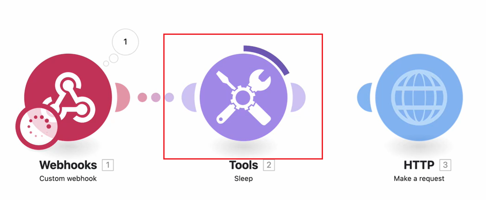

# 실행 중인 시나리오에서 데이터 흐름 보기

실행 중인 시나리오를 보고 데이터가 어떻게 이동하는지 확인할 수 있습니다.

시나리오가 실행되는 동안 활성 모듈은 모듈 주위에 늘어나는 링이 표시됩니다. 고리에는 모듈이 실행 중이지 진행 중임이 아닙니다. 빠르게 실행되는 모듈은 링의 작은 부분만 표시할 수 있습니다.

모듈이 실행되면 출력 표시기가 나타납니다.

모듈이 둘 이상의 번들을 처리하는 경우 처리된 각 번들에 대해 링이 나타나고 출력되는 각 번들에 대해 출력 표시기가 카운트됩니다.

시나리오 데이터 흐름에 대한 자세한 내용은 [시나리오 실행 흐름](/help/workfront-fusion/references/scenarios/scenario-execution-flow.md)을 참조하세요.

## 액세스 요구 사항

+++ 을 확장하여 이 문서의 기능에 대한 액세스 요구 사항을 봅니다.

이 문서의 기능을 사용하려면 다음 액세스 권한이 있어야 합니다.

<table style="table-layout:auto">
 <col> 
 <col> 
 <tbody> 
  <tr> 
   <td role="rowheader">[!DNL Adobe Workfront] 패키지</td> 
   <td> 
임의
 </td> 
  </tr> 
  <tr data-mc-conditions=""> 
   <td role="rowheader">[!DNL Adobe Workfront] 라이센스</td> 
   <td> 
새로운 기능: [!UICONTROL Standard]

또는

현재: [!UICONTROL Work] 이상
 </td> 
  </tr> 
  <tr> 
   <td role="rowheader">[!DNL Adobe Workfront Fusion] 라이센스**</td> 
   <td>
   
현재: [!DNL Workfront Fusion] 라이선스 요구 사항이 없습니다.

   
또는

   
레거시: 모두 

   </td> 
  </tr> 
  <tr> 
   <td role="rowheader">제품</td> 
   <td>
   
신규:
 <ul><li>[!UICONTROL Select] 또는 [!UICONTROL Prime] [!DNL Workfront] 계획: 조직에서 [!DNL Adobe Workfront Fusion]을(를) 구매해야 합니다.</li><li>[!UICONTROL Ultimate] [!DNL Workfront] 계획: [!DNL Workfront Fusion]이(가) 포함되어 있습니다.</li></ul>
   
또는

   
현재: 조직에서 [!DNL Adobe Workfront Fusion]을(를) 구매해야 합니다.

   </td> 
  </tr>
  <tr data-mc-conditions=""> 
   <td role="rowheader">액세스 수준 구성*</td> 
   <td> 
     
조직의 [!DNL Workfront Fusion] 관리자여야 합니다.

     
팀의 [!DNL Workfront Fusion] 관리자여야 합니다.

   </td> 
  </tr> 
   </td> 
  </tr> 
 </tbody> 
</table>

이 표의 정보에 대한 자세한 내용은 설명서에서 [액세스 요구 사항](/help/workfront-fusion/references/licenses-and-roles/access-level-requirements-in-documentation.md)을 참조하십시오.

[!DNL Adobe Workfront Fusion] 라이선스에 대한 자세한 내용은 [[!DNL Adobe Workfront Fusion] 라이선스](/help/workfront-fusion/set-up-and-manage-workfront-fusion/licensing-operations-overview/license-automation-vs-integration.md)를 참조하세요.

+++

## 실행 중인 시나리오에서 데이터 흐름 보기

1. 왼쪽 패널의 **[!UICONTROL 시나리오]** 탭을 클릭합니다.
1. 데이터 흐름을 보려는 시나리오를 선택합니다.
1. 시나리오가 실행되고 있지 않으면 활성화하거나 **한 번 실행**&#x200B;을 클릭하여 시나리오 실행을 시작합니다.
1. 실행 기록 패널의 현재 실행 중 섹션에서 보려는 실행을 선택합니다.

