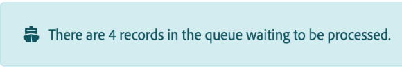

# 웹후크의 대기열 보기

많은 서비스는 서비스에서 특정 변경 사항이 발생할 때마다 즉시 알림을 전송할 수 있도록 웹후크를 제공합니다. Webhooks라고도 하는 인스턴스 트리거는 이러한 이벤트를 사용하여 시나리오를 시작할 수 있습니다. 이벤트가 처리를 기다리는 동안(예: 시나리오가 이미 실행 중인 경우) 웹후크의 대기열로 이동합니다. 웹후크의 큐를 볼 수 있습니다.

들어오는 웹후크 데이터는 시나리오 설정 패널에서 데이터 기밀성 옵션을 설정한 방법과 관계없이 항상 대기열에 저장됩니다. 데이터가 시나리오에서 처리된 후 큐에서 영구적으로 삭제됩니다.

웹후크에 대한 자세한 내용은 [인스턴트 트리거(웹후크)](/help/workfront-fusion/references/modules/webhooks-reference.md)를 참조하십시오.

## 액세스 요구 사항

+++ 을 확장하여 이 문서의 기능에 대한 액세스 요구 사항을 봅니다.

이 문서의 기능을 사용하려면 다음 액세스 권한이 있어야 합니다.

<table style="table-layout:auto">
 <col> 
 <col> 
 <tbody> 
  <tr> 
   <td role="rowheader">Adobe Workfront 패키지</td> 
   <td> 
임의
 </td> 
  </tr> 
  <tr data-mc-conditions=""> 
   <td role="rowheader">Adobe Workfront 라이선스</td> 
   <td> 
새로운 기능: 표준

또는

현재: [!UICONTROL Work] 이상
 </td> 
  </tr> 
  <tr> 
   <td role="rowheader">Adobe Workfront Fusion 라이센스**</td> 
   <td>
   
현재: Workfront Fusion 라이센스 요구 사항이 없습니다.

   
또는

   
레거시: 모두 

   </td> 
  </tr> 
  <tr> 
   <td role="rowheader">제품</td> 
   <td>
   
신규:
 <ul><li>[!UICONTROL Select] 또는 [!UICONTROL Prime] Workfront 플랜: 조직에서 Adobe Workfront Fusion을 구매해야 합니다.</li><li>[!UICONTROL Ultimate] Workfront 계획: Workfront Fusion이 포함됩니다.</li></ul>
   
또는

   
현재: 조직은 Adobe Workfront Fusion을 구매해야 합니다.

   </td> 
  </tr>
 </tbody> 
</table>

이 표의 정보에 대한 자세한 내용은 설명서에서 [액세스 요구 사항](/help/workfront-fusion/references/licenses-and-roles/access-level-requirements-in-documentation.md)을 참조하십시오.

Adobe Workfront Fusion 라이선스에 대한 자세한 내용은 [Adobe Workfront Fusion 라이선스](/help/workfront-fusion/set-up-and-manage-workfront-fusion/licensing-operations-overview/license-automation-vs-integration.md)를 참조하십시오.

+++

## 웹후크의 대기열 보기

들어오는 웹후크의 모든 메시지는 웹후크의 큐에 저장됩니다.

현재 시나리오에 대기열이 있는 경우 해당 시나리오에 배너가 표시됩니다.

Webhook의 대기열을 보려면

1. 왼쪽 메뉴에서 **[!UICONTROL 웹후크]**&#x200B;를 클릭합니다.
1. 대기열을 보려는 웹후크를 찾습니다.
1. 수신된 이벤트 단추에서 이벤트 수를 찾습니다.

   

1. 대기열의 이벤트에 대한 세부 사항을 보려면 버튼을 클릭합니다.
