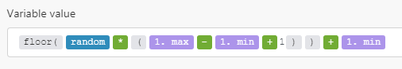

# 수학 변수

## pi

수학 기호 $\pi$를 나타냅니다.

## [!UICONTROL random]

[`0`,`1`] 범위의 부동 소수점 의사 난수를 반환합니다(`0` 포함, `1` 제외).

[`min`,`max`] 범위의 정수 의사 난수를 생성하려면 다음 수식을 사용하십시오(`min` 및 `max` 모두 포함).



```
floor(random * (1.max - 1.min + 1)) + 1.min
```
