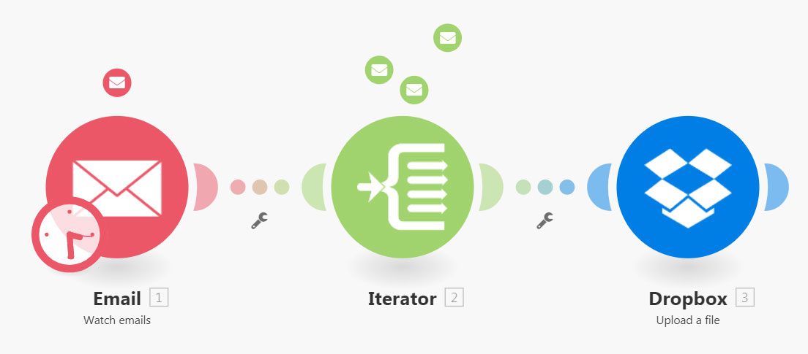
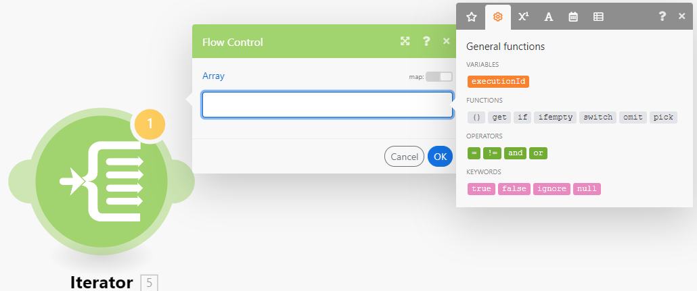

# [!UICONTROL 반복자] 모듈

[!UICONTROL 반복자]은(는) 배열을 일련의 번들로 변환하는 모듈 유형입니다. 각 배열 항목은 별도의 번들로 출력됩니다.

## 액세스 요구 사항

+++ 을 확장하여 이 문서의 기능에 대한 액세스 요구 사항을 봅니다.

<table style="table-layout:auto">
 <col> 
 <col> 
 <tbody> 
  <tr> 
   <td role="rowheader">Adobe Workfront 패키지</td> 
   <td> 
모든 Adobe Workfront 워크플로 패키지 및 모든 Adobe Workfront 자동화 및 통합 패키지

Workfront Ultimate

Workfront Prime 및 Select 패키지 및 Workfront Fusion 추가 구매.
 </td> 
  </tr> 
  <tr data-mc-conditions=""> 
   <td role="rowheader">Adobe Workfront 라이선스</td> 
   <td> 
표준

작업 이상
 </td> 
  </tr> 
  <tr> 
   <td role="rowheader">제품</td> 
   <td>
   
조직에 Workfront 자동화 및 통합이 포함되지 않은 Select 또는 Prime Workfront 패키지가 있는 경우 조직에서 Adobe Workfront Fusion을 구매해야 합니다.</li></ul>
   </td> 
  </tr>
 </tbody> 
</table>

이 표의 정보에 대한 자세한 내용은 설명서에서 [액세스 요구 사항](/help/workfront-fusion/references/licenses-and-roles/access-level-requirements-in-documentation.md)을 참조하십시오.

+++## [!UICONTROL 반복자] 모듈 구성

일반 반복자 모듈에는 단일 필드인 [!UICONTROL 배열] 필드가 있습니다. 이 필드에는 별도의 번들로 변환하거나 분할할 배열이 포함됩니다.

다른 커넥터들은 그 반복기에 특정한 반복기 모듈들을 포함할 수 있다. 여기에는 반복할 배열을 출력하는 모듈을 선택할 수 있는 Source 모듈 필드가 포함되어 있습니다.

자세한 내용은 [모듈 구성](/help/workfront-fusion/create-scenarios/add-modules/configure-a-modules-settings.md)을 참조하세요.

>[!BEGINSHADEBOX]

**예:**

* 아래 시나리오는 첨부 파일이 있는 전자 메일을 검색하고 첨부 파일을 선택한 [!DNL Dropbox] 폴더에 단일 파일로 저장하는 방법을 보여 줍니다.

  이메일에는 여러 첨부 파일이 포함될 수 있습니다. 첫 번째 모듈 다음의 [!UICONTROL 반복자] 모듈을 사용하면 시나리오가 각 첨부 파일을 개별적으로 처리할 수 있습니다. [!UICONTROL 반복자] 모듈은 첨부 파일의 배열을 단일 번들로 분할합니다. 첨부 파일이 한 개 있는 각 번들은 선택한 [!DNL Dropbox] 폴더에 한 번에 하나씩 저장됩니다. 반복자 모듈의 [!UICONTROL 배열] 필드에는 `Attachments` 배열이 포함되어야 합니다.

  

>[!ENDSHADEBOX]

## 문제 해결

### 문제: 매핑 패널에 매핑 가능한 항목이 [!UICONTROL 반복자] 모듈에 표시되지 않습니다.

[!UICONTROL 반복자] 모듈에 배열 항목의 구조에 대한 정보가 없는 경우 [!UICONTROL 반복자] 모듈 다음에 있는 모듈의 매핑 패널에 [!UICONTROL 반복자] 모듈 아래에 두 개의 항목(`Total number of bundles` 및 `Bundle order position`)만 표시됩니다.

이는 각 모듈이 출력하는 항목에 대한 정보를 제공해야 하므로 이러한 항목이 후속 모듈의 매핑 패널에 제대로 표시될 수 있기 때문입니다. 그러나 일부 모듈에서 이 정보를 제공하지 못할 수도 있습니다. 예를 들어 데이터 구조가 누락된 [!UICONTROL JSON] > [!UICONTROL JSON 구문 분석] 또는 [!UICONTROL Webhooks] > [!UICONTROL 사용자 지정 Webhook] 모듈은 정보를 제공하지 않습니다.

#### 솔루션

해결 방법은 시나리오를 수동으로 실행하는 것입니다. 이렇게 하면 모듈이 출력을 생성합니다. 그런 다음 Fusion은 이 출력의 형식을 시나리오의 이후 모듈에 적용할 수 있습니다.

예를 들어 시나리오에는 데이터 구조 없이 [!UICONTROL JSON] > [!UICONTROL JSON 구문 분석] 모듈이 포함됩니다.

이 JSON 모듈에 연결된 [!UICONTROL 반복자] 모듈이 모듈의 출력을 [!UICONTROL 반복자] 모듈의 설정 패널에 있는 배열 필드에 매핑할 수 없습니다.

이 문제를 해결하려면

시나리오 편집기에서 시나리오를 수동으로 시작합니다.

>[!NOTE]
>
>전체 시나리오가 실행되지 않도록 하려면 다음을 수행할 수 있습니다.
>
>* 흐름이 더 이상 진행되지 않도록 하려면 [!UICONTROL JSON] > [!UICONTROL JSON 구문 분석] 모듈 뒤에 있는 모듈의 연결을 해제하십시오.
>  >   또는
>* [!UICONTROL JSON] > [!UICONTROL JSON 구문 분석] 모듈을 마우스 오른쪽 단추로 클릭하고 컨텍스트 메뉴에서 **[!UICONTROL 이 모듈만 실행]**&#x200B;을 선택하여 [!UICONTROL JSON] > [!UICONTROL JSON 구문 분석] 모듈만 실행합니다.

[!UICONTROL JSON] > [!UICONTROL JSON 구문 분석]이 실행되면 반복자 모듈을 포함하여 모든 후속 모듈에 해당 출력에 대한 정보를 제공할 수 있습니다. 그러면 반복자 설정의 매핑 패널에 다음 항목이 표시됩니다.

또한 [!UICONTROL 반복자] 모듈 뒤에 연결된 모듈의 매핑 패널에는 배열에 포함된 항목이 표시됩니다.

