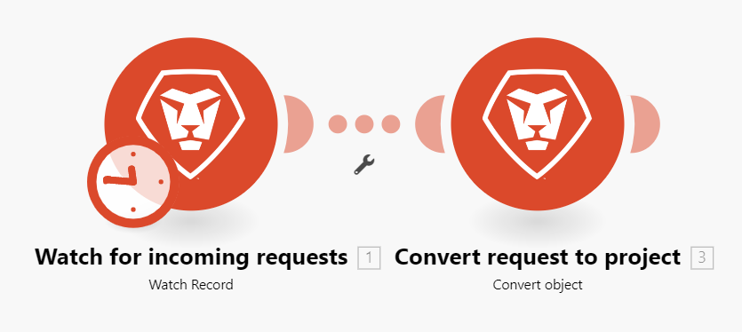

# 시나리오 실행 흐름

이 문서에서는 시나리오가 실행되는 방식과 그 사이로 데이터가 흐르는 방식, 각 모듈에서 처리된 데이터를 보는 방법에 대해 설명합니다.

## 시나리오 실행 흐름

시나리오가 올바로 설정되고 활성화되면 정의된 일정에 따라 실행됩니다.

시나리오가 시작되면 첫 번째 모듈이 관찰하도록 설정된 이벤트에 응답합니다. 데이터를 반환하면 해당 데이터가 번들로 패키지됩니다. 이 시나리오는 각 이벤트에 대해 하나의 번들을 반환합니다. 예를 들어 모듈이 문제를 감시하도록 설정된 경우 발견된 각 문제에 대한 데이터 번들을 반환합니다.

트리거 모듈이 데이터 번들을 반환하는 경우, 해당 번들은 다음 모듈로 전달되고 시나리오가 계속되어 번들을 연속되는 각 모듈을 통해 한 번에 하나씩 전달합니다.

번들이 모든 모듈을 통해 올바르게 처리되면 시나리오 세부 정보 페이지에서 시나리오가 성공으로 표시됩니다.

### 예: [!UICONTROL [!DNL Workfront Fusion] for Work Automation]

>[!BEGINSHADEBOX]

**예:** [!DNL Workfront]에서 들어오는 요청을 감시한 다음 [!DNL Workfront] 프로젝트로 변환하는 이 시나리오에서는 데이터가 다음과 같이 이동합니다.

첫 번째 모듈에서 수행되는 시나리오의 첫 번째 단계는 요청을 감시하는 것입니다. 검색되는 각 요청은 하나의 번들로 간주됩니다. 번들을 찾지 못한 채 모듈이 실행되면 첫 번째 모듈 이후 시나리오가 종료됩니다.

첫 번째 모듈이 번들을 반환하는 경우 번들은 나머지 시나리오를 통과합니다. 이 예에서 번들은 요청을 프로젝트로 변환하는 두 번째 모듈로 이동합니다.

>[!ENDSHADEBOX]

### 예: [!UICONTROL [!DNL Workfront Fusion] for Work Automation and Integration]

>[!BEGINSHADEBOX]

**예:** [!DNL Adobe Workfront]에서 문서를 다운로드하여 [!DNL Dropbox]의 폴더로 보내는 이 시나리오에서는 다음과 같이 데이터가 흐릅니다.

첫 번째 모듈에서 수행되는 시나리오의 첫 번째 단계는 Workfront의 문서를 감시하는 것입니다. 찾은 각 문서는 하나의 번들로 간주됩니다. 번들을 찾지 못한 채 모듈이 실행되면 첫 번째 모듈 이후 시나리오가 종료됩니다.

번들이 반환되면 번들은 나머지 시나리오를 통과합니다. 이 예제에서 나머지 시나리오는 [!DNL Dropbox] 폴더에 번들을 업로드하는 두 번째 모듈로 구성됩니다.

첫 번째 모듈이 여러 번들을 반환하는 경우 두 번째 번들을 업로드하기 전에 첫 번째 번들이 [!DNL Dropbox]에 업로드됩니다. 그런 다음 두 번째 번들이 업로드되고, 세 번째 번들이 업로드되는 방식입니다.

>[!ENDSHADEBOX]

## 처리된 번들에 대한 정보

각 모듈에 대해 번들은 다음 모듈로 이동하거나 최종 목적지에 도달하기 전에 4단계 프로세스를 거칩니다.

* 초기화
* 작업
* 커밋/롤백
* 완료

>[!NOTE]
>
>더 큰 시나리오도 이 과정을 거칩니다. 시나리오 수준에서 이 프로세스에 대한 자세한 내용은 [시나리오 실행, 주기 및 단계](/help/workfront-fusion/references/scenarios/scenario-execution-cycles-phases.md)를 참조하십시오.

시나리오 실행이 완료되면 각 모듈에 수행된 작업 수를 보여 주는 아이콘이 표시됩니다. 이 아이콘을 클릭하면 프로세스의 각 단계에 대해 처리된 번들에 대한 세부 정보가 표시됩니다. 사용된 모듈 설정과 각 모듈에서 반환된 번들을 확인할 수 있습니다.

이 예에서 모듈은 다음과 같은 입력 정보를 수신했습니다.

* 발견된 문제의 ID
* 문제가 (프로젝트)로 전환되는 개체
* 프로젝트를 만드는 데 사용할 템플릿의 ID입니다
* 발견된 개체의 레코드 종류(문제인 OPTASK)

처리 후 모듈은 다음 출력 정보를 반환했습니다.

* 새로 생성된 프로젝트의 ID.

모듈에서 두 개 이상의 문제를 발견하면 각 번들에 대한 정보가 각각 캡처됩니다. 두 번째 번들을 설명하는 입력 및 출력 섹션이 있는 Operation 2 영역이 있습니다.

## 시나리오를 실행하는 동안 오류 발생

시나리오 실행 중에 오류가 발생할 수 있습니다. 예를 들어 모듈에서 새 프로젝트를 만드는 데 사용할 템플릿을 삭제한 경우 시나리오가 오류 메시지와 함께 종료됩니다. 오류를 처리하는 방법에 대한 자세한 내용은 [오류 유형](/help/workfront-fusion/references/errors/error-processing.md)을 참조하세요.

## 리소스

* 시나리오 설정에 대한 자세한 내용은 [시나리오 편집기](/help/workfront-fusion/get-started-with-fusion/navigate-fusion/scenario-editor.md)를 참조하십시오.
* 시나리오 세부 정보 페이지에 대한 자세한 내용은 [시나리오 세부 정보](/help/workfront-fusion/get-started-with-fusion/navigate-fusion/scenario-details.md)를 참조하십시오.
* 시나리오 활성화에 대한 자세한 내용은 [시나리오 활성화 또는 비활성화](/help/workfront-fusion/manage-scenarios/activate-deactivate-scenarios.md)를 참조하십시오.
* 시나리오 예약에 대한 자세한 내용은 [시나리오 예약](/help/workfront-fusion/create-scenarios/config-scenarios-settings/schedule-a-scenario.md)을 참조하십시오.
* 모듈에 대한 자세한 내용은 [모듈 개요](/help/workfront-fusion/get-started-with-fusion/understand-fusion/module-overview.md)를 참조하세요.
