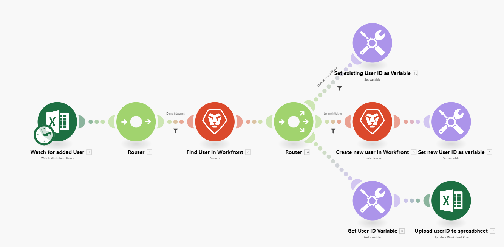

# Adobe Workfront Fusion 라이선스

Workfront Fusion에는 두 개의 라이선스 모델, 새로운 작업 기반 모델 및 레거시 커넥터 기반 모델이 있습니다.

## 운영 기반 라이센스 모델(신규)

새로운 Workfront Fusion 라이선스 모델은 조직에서 사용하는 작업 수를 기반으로 합니다. 이 모델에서 모든 조직은 동일한 기능에 액세스할 수 있습니다.

조직에 Workfront Ultimate 플랜이 있는 경우 Fusion 인스턴스가 플랜에 포함되며 매월 Fusion 작업 수에 제한이 없습니다. 조직에 Workfront Prime 또는 Select 플랜이 있는 경우 Fusion을 구매할 수 있으며 가격은 한 달 동안 수행된 작업의 수를 기반으로 합니다.

새 라이선스 모델에서 작업으로 계산되는 항목에 대한 자세한 내용은 [작업](/help/workfront-fusion/set-up-and-manage-workfront-fusion/licensing-operations-overview/operations-in-workfront-fusion.md)을 참조하십시오.

## 커넥터 기반 라이센스 모델(기존)

Adobe Workfront Fusion 레거시 라이선스 모델에서 Fusion은 사용자가 액세스할 수 있는 기능을 결정하는 두 가지 서로 다른 라이선스를 제공합니다. 조직에서 Workfront Fusion을 구입할 때 이러한 라이선스 중 하나를 선택했습니다.

* [작업 자동화를 위한 Workfront Fusion](#workfront-fusion-for-work-automation)
* [작업 자동화 및 통합을 위한 Workfront Fusion](#workfront-fusion-for-work-automation-and-integration)

조직에 있는 Workfront Fusion 라이선스 유형을 확인하려면 Workfront Fusion 관리자에게 문의하십시오.

### 작업 자동화를 위한 Workfront Fusion

* [작업 자동화를 위한 Workfront Fusion의 이점](#benefits-of-workfront-fusion-for-work-automation)
* [Workfront Fusion for Work Automation에 사용할 수 있는 커넥터 및 모듈](#connectors-and-modules-available-for-workfront-fusion-for-work-automation)
* [작업 자동화를 위한 Workfront Fusion의 예](#example-of-workfront-fusion-for-work-automation)

#### 작업 자동화를 위한 Workfront Fusion의 이점

작업 자동화를 위한 Workfront Fusion 라이선스를 사용하면 Workfront 워크플로를 자동화할 수 있습니다. 작업 자동화용 Workfront Fusion을 사용하면 시나리오를 만들어 조직의 고유한 작업 프로세스를 자동화할 수 있습니다.

Workfront 프로세스를 자동화할 수 있는 이점은 다음과 같습니다.

* 자동화는 더 빠르고 오류 발생 가능성이 낮습니다.
* 의사 결정이 필요하지 않거나 의사 결정이 있는 워크플로우는 if/then과 같은 간단한 논리를 기반으로 자동화에 적합합니다.
* 자동화는 Workfront 제품에서 직접 다루지 않는 조직에서 사용하는 워크플로우의 특정 요구 사항을 처리할 수 있습니다.

#### Workfront Fusion for Work Automation에 사용할 수 있는 커넥터 및 모듈

Workfront Fusion for Work Automation 라이센스를 사용하면 다음에 액세스할 수 있습니다.

* Adobe Workfront
* Workfront Proof
* 웹후크
* 다음과 같은 도구 및 변환기 모듈

   * 보관
   * CSV
   * 데이터 저장소
   * 이미지
   * JSON
   * 수학
   * MIME
   * XML

#### 작업 자동화를 위한 Workfront Fusion의 예

다음 예제는 워크플로를 보여 줍니다.

1. 필드 변경 사항 감시
1. 개체가 할당된 사용자를 포함하여 필드가 연결된 개체에 대한 정보를 가져옵니다.
1. 개체가 할당된 사용자에게 필드 변경에 대한 알림을 보냅니다.

### 작업 자동화 및 통합을 위한 Workfront Fusion

* [작업 자동화 및 통합을 위한 Workfront Fusion의 이점](#benefits-of-workfront-fusion-for-work-automation-and-integration)
* [작업 자동화 및 통합을 위해 Workfront Fusion에서 사용할 수 있는 커넥터 및 모듈](#connectors-and-modules-available-for-workfront-fusion-for-work-automation-and-integration)
* [작업 자동화 및 통합을 위한 Workfront Fusion의 예](#example-of-workfront-fusion-for-work-automation-and-integration)

#### 작업 자동화 및 통합을 위한 Workfront Fusion의 이점 {#benefits-of-workfront-fusion-for-work-automation-and-integration}

작업 자동화 및 통합을 위한 Workfront Fusion 라이센스를 사용하면 작업 자동화를 위한 Workfront Fusion 라이센스의 모든 기능에 액세스할 수 있습니다. 또한 이 라이선스를 사용하면 시나리오에서 다른 앱 및 서비스를 사용할 수 있습니다. 예를 들어 Workfront Fusion을 사용하여 Jira 티켓을 가져온 다음 Workfront에서 작업으로 변환하는 프로세스를 자동화할 수 있습니다. Workfront Fusion에 전용 커넥터가 없어도 HTTP 또는 SFTP 커넥터를 사용하여 거의 모든 웹 서비스에 연결할 수 있습니다.

작업 자동화 및 통합을 위한 Workfront Fusion 라이선스의 이점은 다음과 같습니다.

* 작업 자동화 및 통합을 위한 Workfront Fusion에는 작업 자동화를 위한 Workfront Fusion과 관련된 모든 이점이 포함됩니다
* 통합은 워크플로우를 완료할 때 다양한 앱에서 바로 들어오고 나가는 필요성을 줄여 줍니다.
* 애플리케이션 간 데이터 전송을 자동화하면 수동으로 데이터를 전송하는 것보다 빠르고 오류 발생 가능성 감소

#### 작업 자동화 및 통합을 위해 Workfront Fusion에서 사용할 수 있는 커넥터 및 모듈

사용 가능한 전용 커넥터 목록을 보려면 [Fusion 응용 프로그램 및 해당 모듈 참조: 문서 인덱스](/help/workfront-fusion/references/apps-and-modules/apps-and-modules-toc.md)를 참조하십시오.

>[!IMPORTANT]
>
>Workfront Fusion은 거의 모든 웹 서비스에 연결할 수 있습니다. 작업하려는 앱에 전용 커넥터가 없는 경우 [!UICONTROL HTTP], [!UICONTROL SFTP] 또는 [!UICONTROL JSON] 커넥터를 사용하여 웹 서비스에 직접 연결할 수 있습니다.

#### 작업 자동화 및 통합을 위한 Workfront Fusion의 예

다음 예제는 워크플로를 보여 줍니다.

1. 새 사용자를 위한 스프레드시트 보기
1. 사용자가 Workfront에 있는지 확인합니다.
1. 사용자가 없는 경우 Workfront에서 사용자를 만듭니다.
1. Workfront 사용자 ID를 스프레드시트로 다시 업로드합니다.

